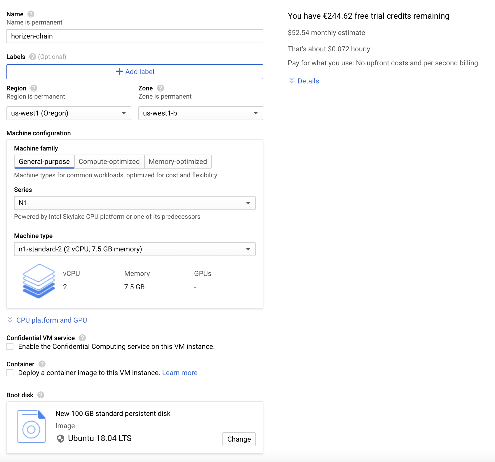
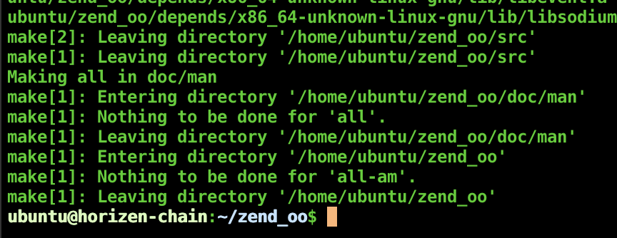
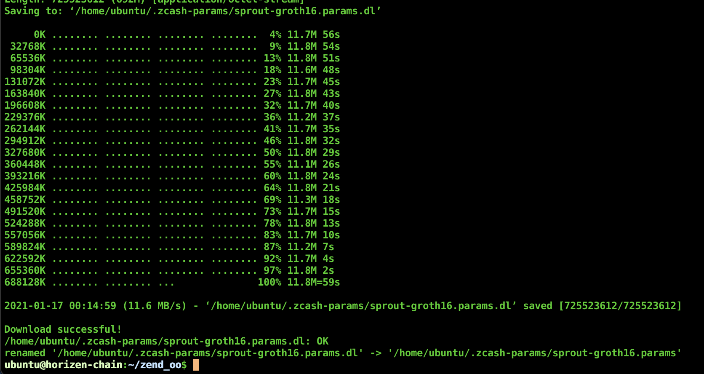
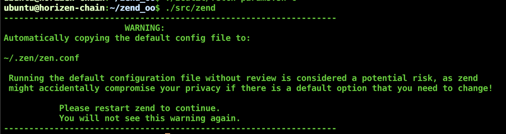
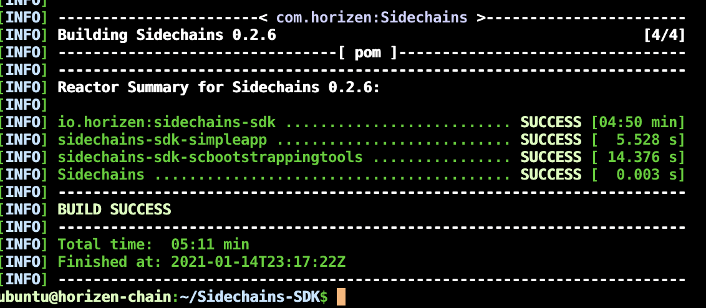
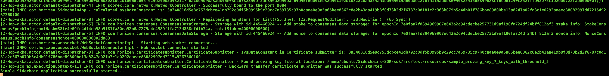

##### tasks
1 -  Create a new sidechain #151 : https://github.com/HorizenOfficial/Sidechains-SDK/issues/151  

  Required steps:  
<ul>
<li>Build zend_oo and Sidechain SDK  </li>
<li>Declare a sidechain  </li>
<li>Start a sidechain node  </li>
<li>Perform a Forward Transfer from the mainchain to the sidechain  </li>
<li>Perform a transfer inside the sidechain  </li>
<li>Perform a Withdrawal Request from the sidechain  </li>
<li>Obtain coins back to the mainchain  </li>
<li>Produce a detailed report that includes the commands used during the test (inputs, outputs, … )  </li>
<li>Please note: the report can be submitted in various ways. We're also in the process of adding file attachment support to our   bounty claim form - there it will be possible to upload your report in .pdf, .docx or .md. For the time being, please submit the report by providing a link to a document, either a private gist, markdown file in a private repo or a Google Docs.  
    Include any feedback you might have related to your test (recommendations, areas of improvements, …)  </li>
</ul>  

Usefull link  
https://github.com/HorizenOfficial/Sidechains-SDK/blob/master/README.md  
https://github.com/HorizenOfficial/zend_oo/blob/sidechains_testnet/README.md  
https://blog.horizen.io/horizen-sidechains-zen-transfer/  
https://blog.horizen.global/horizen-sidechains-the-zendoo-node/  

### REPORT
# Build zend_oo and Sidechain SDK
## Pre-requisite :
### Create a cloud instance on gcp
Create an instance for test, I choose the gcp cloud to do that, instance type n1-standard-2 (2vcpu/7,5GB ram)/ OS ubuntu-18.4  


via cli if you want to automate that
```
gcloud beta compute  instances create horizen-chain --zone=us-west1-b \
                    --machine-type=n1-standard-2 --subnet=default --network-tier=PREMIUM \
                    --image=ubuntu-1804-bionic-v20210112 --image-project=ubuntu-os-cloud --boot-disk-size=100GB
```

### Update system and install pre-requisite tools
```
wget -qO - https://adoptopenjdk.jfrog.io/adoptopenjdk/api/gpg/key/public | sudo apt-key add -
sudo add-apt-repository --yes https://adoptopenjdk.jfrog.io/adoptopenjdk/deb/
echo "deb https://dl.bintray.com/sbt/debian /" | sudo tee -a /etc/apt/sources.list.d/sbt.list
curl -sL "https://keyserver.ubuntu.com/pks/lookup?op=get&search=0x2EE0EA64E40A89B84B2DF73499E82A75642AC823" | sudo apt-key add
sudo apt update
sudo apt-get -y upgrade
sudo apt-get -y install build-essential pkg-config libc6-dev m4 g++-multilib autoconf libtool ncurses-dev unzip git python zlib1g-dev bsdmainutils automake curl wget software-properties-common
sudo apt-get -y install adoptopenjdk-8-hotspot maven sbt net-tools jq
```
Declare JAVA_HOME variable and persist it in ~/.bashrc
```
export JAVA_HOME=/usr/lib/jvm/adoptopenjdk-8-hotspot-amd64/
echo "export JAVA_HOME=/usr/lib/jvm/adoptopenjdk-8-hotspot-amd64/" >> ~/.bashrc
```
## Build zend_oo
```
git clone https://github.com/ZencashOfficial/zend_oo.git
cd zend_oo
./zcutil/build.sh -j$(nproc)
```



And  

```
./zcutil/fetch-params.sh
```



Start zend once to geneate the default config file
```
./src/zend
```

Clean
```
mkdir ~/zen
mv ~/zend_oo/src/zen-* ~/zen/
mv ~/zend_oo/src/zend ~/zen/
rm ~/zend_oo/ -rf
```
## Build Sidechain
```
git clone https://github.com/ZencashOfficial/Sidechains-SDK.git
cd Sidechains-SDK
mvn package 
```


* Sometimes the build fails, with the error below (port used by the integration tests are used), so don't worry, just re-launch the build and it will pass
```
successEchoMessage(com.horizen.websocket.WebSocketChannelImplTest)  Time elapsed: 0.005 sec  <<< ERROR!
javax.websocket.DeploymentException: Adresse déjà utilisée
	at org.glassfish.tyrus.server.Server.start(Server.java:216)
	at com.horizen.websocket.WebSocketChannelImplTest.successEchoMessage(WebSocketChannelImplTest.scala:304)
	at sun.reflect.NativeMethodAccessorImpl.invoke0(Native Method)
	at sun.reflect.NativeMethodAccessorImpl.invoke(NativeMethodAccessorImpl.java:62)
```

Add zend_oo and conf dir to path (and persist it in ~/.bashrc)
```
export PATH=~/zen:$PATH
echo "export PATH=~/zen:\$PATH" >> ~/.bashrc

```
# Declare a sidechain
To declare a sidechain, we need to generate a keypair, a vrf keypair and a proof of creation and verification via sc bootstrapping tools
Generate 3 ramdom 32 caracteres seeds (I used  a password generator for this):
```
KEY_SEED=$(tr -dc A-Za-z0-9 </dev/urandom | head -c 32) && echo KEY_SEED = $KEY_SEED >> ~/.bashrc
VRFKEY_SEED=$(tr -dc A-Za-z0-9 </dev/urandom | head -c 32) && echo VRFKEY_SEED = $VRFKEY_SEED >> ~/.bashrc
PROOF_INFO_SEED=$(tr -dc A-Za-z0-9 </dev/urandom | head -c 32) && echo PROOF_INFO_SEED = $PROOF_INFO_SEED >> ~/.bashrc
SEED=$(tr -dc A-Za-z0-9 </dev/urandom | head -c 32) && echo SEED = $SEED >> ~/.bashrc
```
Generate keypair via generatekey call:
```
KEYS=`java -jar ~/Sidechains-SDK/tools/sctool/target/sidechains-sdk-scbootstrappingtools-0.2.6.jar generatekey {\"seed\":\"${KEY_SEED}\"}`
```
Export result as variables :
```
PUBLIC_KEY=`echo ${KEYS} | jq -r .publicKey` && echo PUBLIC_KEY = $PUBLIC_KEY >> ~/.bashrc
SECRET=`echo ${KEYS} | jq -r .secret` && echo SECRET = $SECRET >> ~/.bashrc
```
Generate vrf keypair via generateVrfKey call:
```
VRF_KEYS=`java -jar ~/Sidechains-SDK/tools/sctool/target/sidechains-sdk-scbootstrappingtools-0.2.6.jar generateVrfKey {\"seed\":\"${VRFKEY_SEED}\"}`
```
Export result as variables :
```
VRF_PUBLIC_KEY=`echo ${VRF_KEYS} | jq -r .vrfPublicKey` && echo VRF_PUBLIC_KEY = $VRF_PUBLIC_KEY >> ~/.bashrc
VRF_SECRET=`echo ${VRF_KEYS} | jq -r .vrfSecret` && echo VRF_SECRET = $VRF_SECRET >> ~/.bashrc
```
Generate a proof of info :
```
PROOF_INFO=`java -jar ~/Sidechains-SDK/tools/sctool/target/sidechains-sdk-scbootstrappingtools-0.2.6.jar generateProofInfo {\"seed\":\"${PROOF_INFO_SEED}\", \"keyCount\":7, \"threshold\":5}`
```
Extract variables :
```
PROOF_INFO_GEN_SYS_CONSTANT=`echo ${PROOF_INFO} | jq -r .genSysConstant` 
PROOF_INFO_VERIF_KEY=`echo ${PROOF_INFO} | jq -r .verificationKey`
PROOF_INFO_SCHNORR_KEY_SEC_1=`echo ${PROOF_INFO} | jq -r .schnorrKeys[0].schnorrSecret`  
PROOF_INFO_SCHNORR_KEY_PUB_1=`echo ${PROOF_INFO} | jq -r .schnorrKeys[0].schnorrPublicKey`  
PROOF_INFO_SCHNORR_KEY_SEC_2=`echo ${PROOF_INFO} | jq -r .schnorrKeys[1].schnorrSecret`  
PROOF_INFO_SCHNORR_KEY_PUB_2=`echo ${PROOF_INFO} | jq -r .schnorrKeys[1].schnorrPublicKey`  
PROOF_INFO_SCHNORR_KEY_SEC_3=`echo ${PROOF_INFO} | jq -r .schnorrKeys[2].schnorrSecret`  
PROOF_INFO_SCHNORR_KEY_PUB_3=`echo ${PROOF_INFO} | jq -r .schnorrKeys[2].schnorrPublicKey`  
PROOF_INFO_SCHNORR_KEY_SEC_4=`echo ${PROOF_INFO} | jq -r .schnorrKeys[3].schnorrSecret`  
PROOF_INFO_SCHNORR_KEY_PUB_4=`echo ${PROOF_INFO} | jq -r .schnorrKeys[3].schnorrPublicKey`  
PROOF_INFO_SCHNORR_KEY_SEC_5=`echo ${PROOF_INFO} | jq -r .schnorrKeys[4].schnorrSecret`  
PROOF_INFO_SCHNORR_KEY_PUB_5=`echo ${PROOF_INFO} | jq -r .schnorrKeys[4].schnorrPublicKey`  
PROOF_INFO_SCHNORR_KEY_SEC_6=`echo ${PROOF_INFO} | jq -r .schnorrKeys[5].schnorrSecret`  
PROOF_INFO_SCHNORR_KEY_PUB_6=`echo ${PROOF_INFO} | jq -r .schnorrKeys[5].schnorrPublicKey`  
PROOF_INFO_SCHNORR_KEY_SEC_7=`echo ${PROOF_INFO} | jq -r .schnorrKeys[6].schnorrSecret`  
PROOF_INFO_SCHNORR_KEY_PUB_7=`echo ${PROOF_INFO} | jq -r .schnorrKeys[6].schnorrPublicKey`  
```
# Start a sidechain node
## Launch Mainchain
```
zend -regtest -websocket -daemon 
Zen server starting
```
Check blocks
```
zen-cli -regtest getblockcount 
0
```
Generate my 220 block on the mainchain to activate the sidechain
```
zen-cli -regtest generate 220
```
Result
```
[
  "0782ffb3d26d584f870178e7f336d067b92801a7afb98a69bfc3c60c616180e6",
  "0996e09f1ca33be6e133365b1ebf6bc1209bc2eb8e28b71309cebd3511af2415",
  "08afa52f4d65e4879c651f06a909ff3bb3f308952f0339e10e33e9080479a843",
  "050197c09410f3199122d2dbf0ce396829a3032e97c893245a6e1b34f3b945a8",
  "0196d1c9762ec3e044b9078b60cbeebf171412dabb1b08fce00d8891264dc246",
  "08b2f0d08716311f3078735fba3c35628e8b1f8f9eac9d8009754a98080c74b7",
  "0776a1bb15a835551b7f86cac94f877ea001f7f7b7dcde46b982942315fccd37",
  "039b1770f19a202d5ff7326cf0a2934c19731d0802274bfbd99810b3c98718bf",
  "0372de30a2bea57888fd96c6a967b8fc85ad3d751a262789c6d2f5228825acde",
  "08697f5f6b3d8e10276580d038c14b5db834da31267886474b8ba9fa2c4bf249",
  "054dfc3a695cc8a78b2bd0f59c2e4d4bbb1e8118743c073db2b740ea1bfa3952",
  "0cf5ac1106acf32b6c7e713fe66a0afc712b8cfab9eab32479f2b681eb546e83",
  "0067efc449e59ab2a68ae4473cf0545a2b32de8a86ef22f237f9149e09ba36b6",
  "02b385fcb74af476ba4ea42d5e4ff128305a43689316f6895be70d224c817f07",
  "04aaf8050c90d1ebae7275a2bc8f3e6a80cf04a25d653e3f04566100e3b6cb2c",
  "06c0da6ae3e6440044e42f7b7164046753a62017bb596d11aa3802248f0435d0",
  "030167880c641d0d79f8d40e8ef21e17533b2e8cadc1c304fb97421976c4f470",
  "0b82c458806dd303e59756a8b115a2440377fd8c84474e3565becced5e5c5011",
  "0a0dce48a8449402372d8ea5fac34fe57362eedf1a48885a5e1a1d25ab819229",
  "05d677c180bb921585409e7dd0acbd3238e274ac9e5a68a1b83bc24b67592438",
  "0ec47803b4bec4741f85b7befb1e02f1059bdcbd6074bc5831ed9df3319ce346",
  "0b8504bb4c6cfe3edb98f359f7f199aa9305ca651d844aca1109095a7d2a0573",
  "05575d59aba87b2d6f375cd2fe02ac9f899e6d5d50effeeda6302a5a66e0f4cb",
  "0d72e01eccbce70a2330896775bf325dede4d376e1bc4938f61668389e0c6b86",
  "0370a64bca17a8706f507303427ace3e257b4a18e9f4af6f26e37d9517943e73",
  "02220d23bad547e221f864b98a3fc9e22228afc4eb1e3717f46ed0855d65e2b4",
  "0c79a80bb5b6104d6639bda80e550dcc2e7833b37851c7485decfe5303ae0511",
  "074edf788487d519b7267605835c5482e593c4867278ba30e82cf7c1dbf956f7",
  "0a3a72082e673ec0d7862c9d5173145eac0235777f89725f9f3e4d56eec23152",
  "07c9ee38dfa913d28c5bae48d9f86a485c2e7c63622b93f408edd1d6abb8aab0",
  "0216c73c1d058e57af70e0d8756051e416a8d9b5a3e54578e3f8a7dbf5109177",
  "07a4f7fb890f8d8bbd427e5142e93b1495bc726b1c6bf81dfcf4e6f074762000",
  "04c337535e15eef2bce2fff08a3c9d9b5dfc1c1320d702f0c507964347bce0ba",
  "0b400a173a2ce9b6fb77ceef8b2397466b2ba0f351f173224657f4b9d35c08c4",
  "0495cff0e12df94192d93e2aba1a27d8b76d0a80039da08d0da71709ea5f3682",
  "08fdac0185f6b5ac305f2a4a08942aa3e3d2cfeaa6c7718f7fa750880fca5b04",
  "000189f97d36c4960df400500a4f67b283dc05b7f3e616d6cbe303d4023a9d80",
  "0189f853d22006cb7946ba73557df88849fcfa01ec1555f4683c5caea16d69de",
  "01556dfd17ec143c57f8f7e405345d400cdf2c7f8025e04add19f61fdc13c59b",
  "079e698087a9caea81b7ba446a73b14999845db38312a5a0cd1079c4c600501e",
  "09392ae7bbe17cf37cc9fcf6afd7f43c4804345dc8739f3a09fc98bcc7d9bea4",
  "0dd7aa1f662b4dcd44227d4daa9a593ae73fefd331579e8f54247a68ca712348",
  "00cd3d480379e5c9b19e2e832ed17d59e7dc076991590903ce8aef0097149f90",
  "0e14b6c9fc4e35155be3cba1e0e0cd32c9bf864fb527c305ac19b632671fe530",
  "0ea9e280af2284eb1e3e09325045f2938840655656ddd6fc0b3dedcb320419e0",
  "07198a42ffb1efed80783a6388cf411bf053533c6500be8f8d23ba76a0be7fad",
  "01f11ee3f29f9b62c0aa34c494a2d732929dde8583afb7d5579bd7039e20aa02",
  "0bcdb3bc4bcf6fd060603afb83df393a4233bede6ddee40c32f7eacb0b0474a9",
  "09521ff221345613c715af2e8882c7f0ddd8c022fde4a1079d20315b775ed9c6",
  "0b3848f92e427f4944edd7570f36d9ecb9567f29eb38200d35bb4723ad036242",
  "0221f0f57eec85d53eebc6315bbe4a554cd2314f6bb88402ec73006916ec62a4",
  "00c6503c8d5b5e5602910c456f88503779834e49f03ae8b536d3cb333265ca96",
  "01d83c8ccbc37c37ce0e8d5e57b7ac9d33045008feca918ce7732ef44e558cf9",
  "0c7e76cc27197b8e6737fa07040db4d39bb69664586a88e0cc587924f25cd5a5",
  "0d8d2231ba67989782007278a9f9f3e167eebb5692605b3f14e278588201df4f",
  "05a2e25b3a75793d3bfc6b3e22ac337eadd7c46a7d2289e7660fa70b4f847c9f",
  "05f122a07525859ccb22cf26d0ba9551d3d4e3d96b539d1f1ed5257961d93941",
  "084200beb97c8da42d9a1f28b41a67521c8968a5a02f5536184e7ec1cc6f3ff5",
  "03df6b7afc4f37c45a86fd30946d1c03daddfd45662cbe0f7a0bd4f990cfdb76",
  "0d28c19931ad95a5fdf3e23816fcab8b4e507632697e649ccdc8f5c8a173efc6",
  "049b849ecff5a1266812a872db77f96fe00b1ddf5589aba85ef04affb0c98eba",
  "03dac12090d44cdc1004ef4d1c8dc5ea8057e620b910d1e77cfc0ff159af38d3",
  "061feddfa78e6a9b4219ccd91b102960ba1e6800da7a01a8b662756f92379271",
  "085319b0d52a8c53bd239ddf4fffd23b2e52f094697936632c67547b4882e0d3",
  "0d9104da6fd9cf64441b57a94312e55f265093c77b3a4aa2d901f6bf3fdc5876",
  "0098634e474f054bccb7033416fab5af420761c22958ef5fd57ed52bd10093f5",
  "09302a9e07d273d56495bd62c110e50cfd9ceba38747a221821dff57eeb419cd",
  "0265d0fb4b907d64fb7f84004975dfcd175808e8d14bf9cff49c9a722427b443",
  "0b536b2f50ade9b2fa1e5f118d8749ae0840eba2926c40a4d5cf09f991a5e1cc",
  "0dfc12ad01c97da0a48f9d5bdb60610b8d7e77abcf37af5b06b9ded301d36bef",
  "08276dfba6c41b67c531827259b0f5b5d9d70e3495d94ea9d86adaf189faa047",
  "0be02c2547bb44630944c156eab6a4a735771a404adb2797138e5b6d7bcc4323",
  "0834d47fd095d64fc74eae449a5597bc9096791561a0144cdbc6acab8e6fd4bc",
  "0a4bc05b5bce64f14be0cbd0e0d59f408bfc29e28832d46aa0139612402d7607",
  "038a6b7579c13a29ae689e2ca2e562e0a0d38a3df56ac3382e1b3b2bf1699bdc",
  "0717f044a6cef175cd7580d61612f773864b4db957a4b546f0abe2eb1639bc0e",
  "0b04fc7b81d660d3ed9cb1b36c491f9b225e42b6e92e1b9c73edd08b8197327e",
  "0e0aa73fce0eeb03a9503aef0b7d1411dcf62b36e27dea18126982fca47476b7",
  "036136419a21d0d3cdde025a60dc862284bfdac6f45a57e58991943f3d8ce353",
  "072ec56bf3a9304b31f68837e5e7144f0fda531222d7456585f14fc7faeed827",
  "098450cb29c30776a1ed31e78471e0eece82f3f8256880381b977b7f488e169f",
  "0ec2c89054db9cfdfca89504cd9c495ee5898ecdaeb9a8ea9ab727c00a08fa48",
  "0db033b767d92bed9ba0fe27035bb9d4a40b020f5584e0048ff7e68e09934dca",
  "039cda52e0a498de4213757bb2b4b2f75061cbea2ca056e30fb71e5ecf0ef30e",
  "031fb059b6f69065a4ca3da95b1a81d3a7d7c7d4231817081ba46baaedbdfebb",
  "0e01e079eb53f44a4e784da0b2ad9b9967a85360e73bc28be80f9f2d4d9267ca",
  "0a0ccb17ff2ff682a2b6a08ac8f45ff4be92254d5a0258f5a748795940157f3f",
  "060ddc3edda4dfa46f7e303f89e33d7c6147a7fd002a4218bc4707e383bf56e2",
  "0b3b22594745f58b4602c8490710ee55c2f5d07efc2c77ddc4f3a3da7c089ab6",
  "0c78c159bafea84764ad1dc7b6b70c38381756b2345b74f80ad80da2d7bef038",
  "0e557234531c0df3cdec174c557707e06c9ca0fdd3d92c15bcb2fa5c6862ead3",
  "0789c577fb7bd61a0b27cc2f70187259724f96a85d30b77bd72d141fdcf21582",
  "00e7386d21444a8b84539d13ee728e98b89fb8a7bc1205e97150e79e0a52150c",
  "026d8af46a2c6e64350eb0d65ce013181902ea6e5bb96d80c27f3d414b90b311",
  "0c5a5ae67244225a68da852c87949ea21afd3d5b8fc0609df18118a31009a4f9",
  "0ca6a85bc0cd5d6dc6cf2b3b0a81205e4e9ced0274b2cc1e47b6d498ce54a8aa",
  "01919a8e6865a96bea507318a4420dd6b5a5d262bcfdd3590411558f4c5c1394",
  "03ee0a19615678b0f3982154bc123b912eb6022593d6ee56982b48b449092527",
  "0eeac558ec4dc9c1e04a8d4cc3ac64698a895472028c29b9c97f77871894896c",
  "0238adadea317b67fe824bf25ea914a26f2efa827337abe6b25323ead057aa91",
  "004098d02fad19f3d8d44e1a12fd7af32cc0dc886b92dfde46d0847cb868302e",
  "0bff503a2ea1e18a29797a02082ede8e3b65b9f281085648947bb74b32227954",
  "01f9ef32bfc1f42ae179936becfee34b91d52e0ed69f018d3b9da72e05b8565e",
  "0d655ed4a985c9f4b908ede671b2c6d37b305486ae8c78d9a11b46641095fb87",
  "06aa918ee6779467e4cfbb9faf2b9b8dd07b438597730d8f9a65c8c2dc177999",
  "04cbdfc731b8e14bd1a4dc2a10eadc64a34fea084e053e209158a7b6632ec1e6",
  "08f16bff0c9ab5d70cb604cb05a630898d0622daa0c9196c46ca8bd0d06c1324",
  "0d645d87cfe9d6e1b22c2e71cdbcd01be4a69b2dbf0db44f5813269670478436",
  "0696823a0c30c3e7e1857702fcb684c54737575062efded5035077681b4d351c",
  "0b41fda76ec1552fab15dfe29f9acf511dfd2e4e968ff3f4577761991ceacc0f",
  "0a6d4f8776b55497f4d0521eb243160d4649c2d5488990c866d1e0ba54af1495",
  "0d1a00246bcbf488019a95bf9faa3362b18e1f762d3770b80f676c229234695e",
  "0ac45898909a96be3cb71e40b561629f37f10685959e4cd5fee05382ed80a75c",
  "0dc4e59ba4d048b34b1b90e6fe71591a609c104887ea064c6dc23c48af4fa232",
  "057f60c2b41bf8e38275ca929d4f5f58c4a57ba1adb1cc83df7000ead1f5a2af",
  "0d4ee965a3b5391572fbb444034d0ce9c7b8f3220fdc9cfbdedc088113f0d1ea",
  "0803e95aedc86b62570d23ba5bb4df34926176334fb60817ec246e0052d44d26",
  "0af0da6f7909eb1e0bc3872408732ec2f3b555912958f548e9eb7e45c7d4676e",
  "0b1780b9dde2e045e9d4f1902def6d557f33c1b4f214c27affb18d239086b634",
  "00b05ca8c1ac01ec0a3dd1dbc97ef28503693d3f9393083d792a7fbfe47fe9f3",
  "078029d23274a0544f7235fab3a8c111542e252a1544a1e2f3d7236520793d51",
  "0efdc5e76fc6149f1d461d5c774a4141b65cb12a61ebba1bc95dcc7753248b01",
  "09ea893dfaab5e1e38eeba6f7422be4d76275d079cff9abdd72cb5eaf4aafe2b",
  "02b69a85052857349c8f0e0c5636e8826cbbb955f70e65cd9080d3a71d958f1c",
  "0e8f7b820e3552302d89c1459859cfb505a455d225fc5ccadb743b5047a70b5d",
  "0d2705c9e9000e6c437eba102f839ea1c5765e19dfb0a8cd36df6475df86ee35",
  "041a565610a5913a76b1e716d2f877baff555fc55c0b20b6c40df179a39ced10",
  "043e53d3f8476fc1cb778d89754b6561845f5ac02ec52d4b0bf072677ab1ae92",
  "0282831477c578b7e8cfe7de5714aa6b85c6073b1cdf2f24506f0bad04fec38c",
  "06016c80a92ea4920be6685f714d73f70d884507222c5b8f2674abf1b1561432",
  "070faa27fb0789f985f52d9ea77bee49c7a3bc6993cb8f74f054a8ea2aaf08e8",
  "0e2936a2b3e902647073bf3f047574e81ed6985f2e86a1fbf17d60025d8d8616",
  "052c46b91a5f1bd7fbbf8ffd7a625b5f00dcdff93afce2b196887cd6cd470f5e",
  "0d02c900bf560fa299c03fcc6845d64cae12e973caae807dbeb92552fca4b743",
  "0a6e5f5b617786394ef44918d98dfbd4491baf018b2ece7d4d356e8141fbaf7e",
  "092d903eddf4e70eab22e04d391d0ae24b5346b0c35332d43954c747a46b8993",
  "03cd3c81a1603e97b3755e15d228bed3d522bff301ec8c6e1beff21722a15fbf",
  "0312bd05900fbc171ac5de83f0acfba50b5a7e0b325c9894ee539ed67397877a",
  "0a1a711839c3cda91f6e70285cdf7a360091fcdae4dcfbe25402b88e410f71ef",
  "01c4274aeb22a002c7c2effb01ad97e192375e35cfe11f7a960b6f0ca2d8f127",
  "004f6c15add2352e07c6fd1dc6ebbff071804137252c79446091c54ada92ab28",
  "0a7365c29e61fdc040c6492abd115f71e3fbd40b0886f6bee04a4a9bcfd4ff11",
  "0becbfdba2157789eb144f55aaedd1977f73db5679ab22cbe919d0fee7531943",
  "0e0aac17f8cfc787b241a091dc1a9302a56ccc2a47e84ada46db7868d1866be5",
  "07fe7ab97cda8cb059479c1e1028118c387902129107d8fff7512783d6e70e62",
  "098d8913ba7ab30e702cb42d26ea58c22f3e6e8010426588512a9ae0409fee04",
  "0e5306452c642f99aaec8327a9003c888f65f3f21e6c7dea49a9a8924af18e57",
  "0bb5006ab971933422379e23628243f4acbff4878a6c4d1ab688873993a280c5",
  "0bb6c1aea7ca1bc661fa23eb439fd955b344b87c4c2e1bb8b26e439335623641",
  "0c9b7a7b0f33f4b3bbbcd6de0caa65764ccd05a26d000bb7168e1168d8018c41",
  "0dd9d720b200df63920eee4bf7d9bf6768b25cd6fb8caa58b113cf3aa1202a87",
  "03301d80c68dae367b67ec07c48ae8a43ab78631d0f16eec34f0788bd64a5d17",
  "0eeb1f5c7d08177a70b1d70661bcbfbe776475d61b528b339c5490857ebdf3c6",
  "09daac3448aabd0985ed71666aa36467443a73c0e9bf35f1618237707fdc995b",
  "0ee222a0438bcd75168088f46d4d8fef7937dcf3ada2ad26e66953e1201af4c7",
  "0d61144fdd266356c6de77567e2de1ab56403af782c788e12bd18e05081ea738",
  "0850275236720d2940cd159ce0ac9dee5ecc3c02cf5c038653ca3d5129cb2bef",
  "0a21c32f02a64d6b0b943ec472905f5a55e8d6a363fc29ffd5a686411aa8ab1b",
  "0d3a975add9da054944beb6e08c8711ae8dba756c223b85539cde691457c86e6",
  "03f1d2cd713dd92dbb833e6ec78024ec871534f51586b3aacf73b4724dc067d3",
  "048422a2662514583bbfd2202f9245daa04540379239771a3ecd599530336018",
  "06aceb2fe18d1441a0bf8fde0d006e1e9f84cd9be04fe146fef6d0f39c1cb518",
  "089b7a97875e8aa7d0d92f0781e0479ab0723591fdbedf6ced7149dd22b12dab",
  "04f707146acb0d6cd5f25ffc10fedbed9260782530f8eb332b7597f0c6b0ce78",
  "018d3168de088140b437ee27e5d85dbab97aa0241e732834099f819b18394f29",
  "060ef5149239f1d3ec7a651be91698e5aa2bf7e2346d22a11adb7139bde5dd3b",
  "0bf0787975fe5412d23aef3dac9c038bf3b132ad7b51ac3f9c3be4bfca46d59b",
  "08993ab72cb7d8c5133e4946496bf1f7564538ca2e21d920c86436332d4466d3",
  "0dcc9f2ebc5eadccc7c37a8f8c3c8e6a425308744713c2038a87df4a729f7d18",
  "0a8df9568e2b794eca92c418df25d505487ae44f6adb6f635041b1658384fb43",
  "0a7114d7c7c50a1035b4fbc2802bb6a03f3eacb0367bf5904ebe7bb7df2e20cb",
  "0a3a6196748514ff9bfac9242c24cdfd6bdcf845196ac4e1b17c44ed670b8f96",
  "0d562bb10538c4dca5c3bb7a702887be1a0c01c266c9b66c4679402ddb924eeb",
  "0abb2f696503e7c67298e41c83e07d8ce3e031b150cc8006e643217953587f52",
  "0371676a23cdf6146de228598587a2a1344d0735b29b1a5c895543ce5f6e02a3",
  "04b5a9568d4fc63115a5026c9d335bff5abf8f4b2d7f5607ac0161eccbebfa6a",
  "06514026aa437a4a8cdb34edaf60be9d1d64e6aa0c503ba7b4f4f5dbc92913fa",
  "056268a8774c57e21148553a790efed2e13cf8330dae1ce0143d3ce79f9f7ef6",
  "02f7e992eb2ed04f62302feb0bd9d5d62e50da3203c16ca21d4f86ba7f0c9b81",
  "09698375f0d0c5b3e928afec7c344e7a3e143d38c117456a36ab944cc1871f3a",
  "013335288d6a434f2ee7e2c65047d4bfea6dad7b7325b74ced4cbab0c277ee98",
  "0151b608c7c2c80204d0e64bfb6792e189dfa6f692a975e0d0c03e7c5fb73800",
  "0b00e27c87cf8e5511cb40d8c6bbfa37a71c92640c76323be8707f3a3c27fb93",
  "06233716e6a3f6a74cbe2d3e745d7d6e082eacba91da27dbde18bad45a5cebcb",
  "0164113f896f4df7019461fd2f7f732ea39cb2b96f9f4cb6fda364bae48c6a14",
  "09f3aeabae3d5f3c875d8680d1b52244653ac1191627a10d7c0cb79e12bce641",
  "09d5fcf5761ed8eff04b65aff1d60369e60a4d64f4f83b36b9933c76bf302076",
  "0109791eecd1106e2cb62617cd002603d954a26adc74bbb70f1cc991e73dad41",
  "0dd01341d3dca5559926ccedf17da7d924448f1775ebf3ea9994cca512f707f8",
  "06921b218cfd05e54e1f42124f7cc97c6e26041cd5dc24d540fc139b1bb7e7a7",
  "0ec6aa2334cadf2e9c66a291071c8a149a64e073b16aaad9b6f91bfac4070163",
  "0a5f586fb74db1db8da8427ba1230a29f4b26f6c4f3946bc2bc450c52b2167ee",
  "0925a8b37c45ab7e782dc76405b94e6a398cf3a758fbe1a3c82d4b82c6429c72",
  "00ab7741433f5545e5a1d00933d7155b4acb0bc4fb281d91235821770ceedb81",
  "09ef8a7e8246d846aae8713538117fee99d1814696cf048e97c58892900bd40b",
  "0ae239b909ae0687287126d7132d80c955e507777eb58f5a98b2a23b2ef5f704",
  "06d7d1913a280b30ef7a09fcc89b361c81c4c70ebae6a40335941193e2d9d59e",
  "0a6d21cdfd4382d148f752c894025af80569128a78b473e89edd148ded375866",
  "0dd1d46e309e81bde3afd5fa8555511a2d05e8e110d1af916ec00541065deb7f",
  "04172fe1833b7680cbf408da225dd474b3bb85e9d205fd7b89cb42ce8e403057",
  "0b4a9d201fa45b1d3265d69980306be9fce48e1791beb6c8ce614ac399fb921f",
  "0ab443500aa03457222696dd6b4c3456072c228e1ffbde0dcc38fdc565d7b06a",
  "067df390916e65036c7ce35949a122bc27afeb12be6c1fef78f8d3869b89ded3",
  "0aa56e561936a5adda238e928d676c65818b4817434c95b3a57498c7126ca874",
  "0cd6f639ae570205923cb4832d92dae5dfe895f64d649bdf2ca91ccba2fab9e4",
  "049b9093d8cc00cea06a3073826266d0532818b50128c87d6c79dd6784c40031",
  "0cc0070de67f99fb53ee13b1215165dcd944cc62e02a4c279f551b09c7328316",
  "0f0b8c501e9786623701db6cfae5eae1ffd53358e9dd8b54eaf2f059fad13189",
  "0ef26288b83afb3a58e1a677f2b1928beec099ad0191c15aa5baeb6fd3b5a341",
  "01a40fac02386914ed47c8b0f21cc7976f7c796ef9ef210adbc4a30104ae8754",
  "05a2184b980b15db1d7766daab17c548d51bf730cd1dd58acfa478a42ddcf59a",
  "0bea174c15e5c0697c379577afc73dbd379a4129e4b1768c75b669c4ed0bccf9",
  "0d379660a31dd65b2e0af71f87c0141bb2bd5ad725536069412304ff885e4f3d",
  "0d7bf4dacd63397fe030693bfdb661ac1dae036ac57691da99ca478bfa9365c0",
  "09010e5fec158abea2163e82331aba601d6a9ee582baa75070bd69bc62ab88cf",
  "01cc76d80b28e9d090ede27944c3d629f73fbb47ee20c20107547b1932ac8f07",
  "012c0ef21588f722454ee24ac8cc733d192943a12b6a39b73b9d41c2ecf571d0",
  "027759ab524ccf941dc07bb58bbc756321e3fd41a1821408055ebba717f9b27b",
  "0933c61cd36c6d36ad4083751a20c66aedb923b15665a4777906350a5a35a51f",
  "0c3f5d188800b0ef7237adaa1e59b1d91c11fe38e8779b997a53132752fa75cf"
]
```
Check that my 220 blocks had been generated
```
zen-cli -regtest getblockcount
```
Result
```
220
```
## Declare my sidechain
```
SC_CREATE=`zen-cli -regtest sc_create 10 "${PUBLIC_KEY}" 400 "${PROOF_INFO_VERIF_KEY}" "${VRF_PUBLIC_KEY}" "${PROOF_INFO_GEN_SYS_CONSTANT}"`
```
Export result as variable :
```
TRX_ID=`echo ${SC_CREATE} | jq -r .txid` && echo TRX_ID = $TRX_ID >> ~/.bashrc
SIDECHAIN_ID=`echo ${SC_CREATE} | jq -r .scid` && echo SIDECHAIN_ID = $SIDECHAIN_ID >> ~/.bashrc
```
Check my transaction
```
zen-cli -regtest gettransaction "${TRX_ID}"
```
Result
```
{
  "amount": -400.00000000,
  "fee": -0.00007124,
  "confirmations": 0,
  "txid": "81af3ed31320a4d475ffd8c956657feebec15711f0b6281ba4c29d05d007a2cc",
  "walletconflicts": [
  ],
  "time": 1610919057,
  "timereceived": 1610919057,
  "vsc_ccout": [
    {
      "scid": "d1d05dc5d5b1d9ce76bcac157787a04a7c2943cd163772ddf49102333fdb4f9c",
      "n": 0,
      "withdrawal epoch length": 10,
      "value": 400.00000000,
      "address": "0d5d7493a31ac95cff1bcad0d54abb1c50fc84c1ee0b937637f7b9a64ea9e06e",
      "wCertVk": "5e7b462cc84ae0faaa5884bd5c4a5a5edf13db210599aeeb4d273c0f5f32967b7071ce2b4d490b9f08f6ce66a8405735c79197cd6773d1c5aeb2a38da1c102df07b05879c77198e5aafa7feed25d4137e86b3d98d9edd9547a460f1615b10000ee9570fbffedd44170477b37500a0a1cb3f94b6361f10f8a68c4075fbc17542d7174b3d95e12ddb8aea5d6b6c53c1df6c8f60010cd2e69902ba5e89e86747569463a23254730fc8d2aabf39648a505df9dcce461443b181ef3eda46074070000550836db2c97820971db6b1421e348d946ed4d3f255295abea46556615e3123de33ec56f784f70302901a4bc10c79c6a8b1e32477aeff9fba75876592981b678fc5a2703ac0b3055e567a6cb1ebab578fc4f9121fd968680250696cb85790000078fcfb60bdfc79aa1e377cb120480538e0236156f23129a88824ca5a1d77e371e5e98a16e6f32087c91aa02a4f5e00e412e515c3b678f6535141203c6886c637b626a2ada4062d037503359a680979091c68941a307db6e4ed8bc49d21b00002f0e6f88fb69309873fdefb015569e5511fb5399295204876543d065d177bf36ab79183a7c5e504b50691bc5b4ed0293324cfe2555d3fc8e39485822a90a91afcd4ef79ec3aefbd4cbe25cbccd802d8334ce1dce238c3f7505330a14615500001f89fbe1922ab3aa31a28fd29e19673714a7e48050dee59859d68345bb7bee7d5e888d8b798a58d7c650f9138304c05a92b668294c6114185ccb2c67ce0bbbb7e1dcbb6d76f5cacd7c9732a33b21d69bd7a28c9cca68b5735d50413862bc0100308bb0dd0bd53f3d1134966702dd3c7cc8b58b270a6996a646493250b0d5f3978d0c971f8fa7a0c958f3efe2fa5269244973fafb701c2eb66dd25901f93d677ab6c538c1ed11f115e52d3f2c7087ea40c3e8cd089376baa38842e9429b5f0000d19a8d874d791f952f13d3c8ecd92e44009c09815e5ae6a8e5def7ea52fe3de4accfb5ba2aa401fbcec14b069cd0dc0f66ab025b45ef9831a26acf58673db7487043654e7980fcb2b6c1bd7593a4dfff810436f653e309121c7ccf2df70b010000732254ec6df184be360cd9ed383ed7c8c236d7761cfc0ce4e7f0cac5a06f4edab9cfc75a7dc1449c0e18ed9564c974c2e1b6847c637f74e5d391cbc80fc6e672ffd66b5ce4fb73bda8359ab8a0ea1e855df1e07d82f93c935c7e1a9a55c5000065efdbb7c3e82291a482b2f24cbd46f4dd02c370cf6dcfe8fb3c00b8b004b5ad51369b1f1b134a824d1f16d72ca6a27ba2d6190150329139cf2c6d9e5a14722f8d39b96b882c1f60a7b230e929819e2abe1cd9d7f3e8c726b1a94d20c8010100732c396eca6ffa1bf851cef449f2f087edd93e4f641b4bd93a482d9f129e675aedb688993d4e2cee824d2803301364ba10fbb66895927adb53bad8aefe8a1caab6f4ccb45883e414a1223ac7f90a89087cd752dfa0c7b3e19bbae000edd5000028d1d23c627d1252d2a2a20a246af2280f50e3fde667873aadd9893ba6833118358398e7428e717128f764714a8d52b090c1f554f58e25ea815338d7bc7326c949567e74f2f2ab3c88f5075fea75594608b8937c9059a42d712ffbd1bd980100000000000250c1a474689e375a309446e5cdd3a0c26cecdcff5c7b8cdc0728868983f1a35a49e3a1bae6f969c3d47356c08d3d169d2c0a2be908d82cd35f41a23d8c2924a9f790ab3a00d53061d440a176670d6a32de2ecd19cf8a9774729c09a6ea4d0100d8838bf55d95521291da12294b302c66042eda0dc2acc79360a1fdd8c9a366fa790c52bf926c2d96b5ba88a3a443487c5235f7c476f350c2101cfbe3bd0361dd291ebc5e42c097a158704b71006886a3662ca6db7d816b4ad12444835d89000000795ce2b34aef921ccb3d9b9695f5d3fe0a03743c955cfcf01f8a1815a7c8b03de85fe15201d4b4b6f401cb334a6988ea5bde8986a468c47c3c6a5ae96a3160ff15e06699ea82bd40c0d5547fe1be77af7817861bbfcca3f4232f05a9cec800006c216565cee4d57b32d2d70bb3cb8d4a967c0eb5d7137b2ec58466f3d4d3b5375e4baa823bcc29c6ad877d9708cd5dc1c31fa3883a80710431110c4aa22e97b67fa639f54e86cfab87187011270139df7873bed12f6fb8cd9ab48f389338010000",
      "customData": "92deffedf2c0e1d04b10d955822ca834e14b085230fec88598292db0f12cff3839c2b7b12890d4c438c8011b7c1e4d0fd36cd7daee5c80843e561b5dea48dbfc031db9db5aa770bb73f18398e631d4f7263156be39d695351e36fe21285f0100ad085c069abe151e49b3c77b9536cd33b75600e0b72a2e5ecb6837c647649d151353f5be6fb137b56ebee0fd59f1a1355c7bdc61908192e61e8d8f66ea4e31a09c6d971c0875e265d3bb1faad7aa224b25e2780179fadd4707327416dd75010000",
      "constant": "93b23cfac8ccf2e60dfa43df03bd8f51ac505c705ed8f2b5aecab9d6675e5546189e40fa700327d5c8859afdffc0152b9ded3565c9fe99827ad2bcaa0adeb1d99c5612b011da56cabd556d8fc70bd4019f53b47b326f8d376bada93496670100"
    }
  ],
  "vft_ccout": [
  ],
  "vjoinsplit": [
  ],
  "details": [
    {
      "sc address": "0d5d7493a31ac95cff1bcad0d54abb1c50fc84c1ee0b937637f7b9a64ea9e06e",
      "category": "crosschain",
      "amount": -400.00000000,
      "fee": -0.00007124,
      "size": 7118
    }
  ],
  "hex": "fcffffff23bb79b25eba8e9be9fa1128598c62e7be2add79657967035f855c47a8060bc1f5000000006a47304402206f5e650b2b61c31875ea4353d223066afc6a13477fc98ffafedcb39fbfb1b45402202fc777f73dfe914c11cbfafb2d5e4ab852c3f9b8fa64081b4c20208049c3ba6a012102f51a344aefdb7fe1c5995296e38b12472aa08f654733fd82e15b348eaf2c17c8feffffff571b40d9ee69ad9fbc6128055fb91cd2d8c7b2dae75a8e8969cef1b90da9a49e000000006a473044022078de4492ce4fb30ba5693dc88851fc1ec2e41545dde8fc70b2b36d2dfe3a90c4022031d24d996c4f074b6c13b47509fb59068925b222fe3e9e06dc3af7fba11428a8012102f51a344aefdb7fe1c5995296e38b12472aa08f654733fd82e15b348eaf2c17c8feffffff1d1a77dca5a2f0e2cec01dc93f3fa7afd075f5bcdc60b89027b209261d076ef8000000006a47304402206317b1d339de56779c33d5a61861cd6e48cc449dcdd20fe7179ba9edfec3e05802204f2ac2f1662f285b4c96161ba6a21d476eef3e8aa0ea588ca539a00247cc3f8d012102f51a344aefdb7fe1c5995296e38b12472aa08f654733fd82e15b348eaf2c17c8feffffffe9b2a317647d94b5e6d4e9432e50c38fed3a4e7729aa5afdf6ac1232ae74ed68000000006a4730440220275eb2ea24ea7f6013121e3eedbeea6aacf935790e9d8e765d4df81af4770269022043f192501799f75d4869c129887811d99aa7b075bbb6e278695aeca24873d170012102f51a344aefdb7fe1c5995296e38b12472aa08f654733fd82e15b348eaf2c17c8fefffffff07cb90bd504cf11b89daf556ffa0ec24ffc6a7a2580b6f2df91270f559ab73e000000006a47304402201e30ac1c1f0c909e37f12610ec0d8984e71ed867c2c99b3c60e2eb999d85f0c10220557bc924007a03b86101b23b9f91a7789b7e19d4f565656b4e1c7d6cd9b4e01a012102f51a344aefdb7fe1c5995296e38b12472aa08f654733fd82e15b348eaf2c17c8feffffffd6690653c5ed700fa9edaa815f9cc0b3dad8538dc302ff3b8b943e61595bb50d000000006a473044022054d8181bf4cb71565aa5577b0626ea0de8bcd353d79d27b29ee35e7c001ab8e602203b088860d5bcf85633630a416a0a03828a1ab417c6128b4aaa1a9d122f165301012102f51a344aefdb7fe1c5995296e38b12472aa08f654733fd82e15b348eaf2c17c8feffffff200b7bc1d72e0221fa8f37c0205512ef6d07a20a0e61ec9c60925b0e503d181d000000006b483045022100ddd2be831a18718e51b62c012558945a2c447d3537fc29056cd043c14a8224930220447040a3eca7210d11422bd3c938aa35711be222310f195bca027f992cfa39b0012102f51a344aefdb7fe1c5995296e38b12472aa08f654733fd82e15b348eaf2c17c8feffffff72ff2aa7576bf00a648fe8ee244a2ac51924b8c2e10e8713dbe9b09fd6b3a351000000006a473044022017a7b355ba9c479914f63d0ea89a15f39548022ba31eebf75336b06714f5d1c202200b8616c943303855bb55de6ff5872e11c071ac1f44c0e2cc32b3407915f99bd6012102f51a344aefdb7fe1c5995296e38b12472aa08f654733fd82e15b348eaf2c17c8feffffffbc95f0ba735dbfaf8e30cdd6713fb603861c9f4b4e26159a851bf273be951850000000006a473044022032602c63e15b7fcd5667ee6c78e38eeb2459905d708474930130de5934ba6629022006213b838bf8cb4d5069636aec582fe3cd7b1ea6b10a34d4d9611082b52cc009012102f51a344aefdb7fe1c5995296e38b12472aa08f654733fd82e15b348eaf2c17c8feffffff846a13f43e725cee6231832ebb4f025f9c2432b5e799402a7b516d2d4865dca3000000006b483045022100d5ceced755c6404fd96d845bf3c27645eeacffc0fa3d6fd945fa36b07b35e0830220495a391af6cae5c5253d899dd259d013a2836f7e3f0c7ce8b0bce03abf8764f6012102f51a344aefdb7fe1c5995296e38b12472aa08f654733fd82e15b348eaf2c17c8feffffff9dbd38b3968ae1c2733636fad8bcb491ea08256fbab62f415d71678447dad3f6000000006b4830450221008ddc0d554a0a5af20f77a73d518d1db5553abb22630a187ea0f8d25e9a0fd84502202e46c561850338ddd39a80a7307216f94a73849fe44797cb1e6d356b74dc6cbf012102f51a344aefdb7fe1c5995296e38b12472aa08f654733fd82e15b348eaf2c17c8feffffff79bb8904f5b596c4b2da936ebda4544d0e723f897b746894ea4be04f1be1f493000000006b483045022100e6c8d4c3632b88507a310603d192ac85d3cce0238a0414b0887f77210f60dae302207d3e30177da51b564bdc6a7e9ef56f8ab8b3c5a9e695269bc9c37a62b5d91489012102f51a344aefdb7fe1c5995296e38b12472aa08f654733fd82e15b348eaf2c17c8feffffff6ab9063a4cad6b3a3c0c9e439d5309e2e46a7ddc632d154cd859a8df546ac5e6000000006a47304402207801897cffed13ab9b34abb53d397a253a86b8b3b302af0a3b19ddfc8b5cedcf02205d98718fbc81141f5f96048c0adeeb6bc4275b6c25b71ff3fca3272bc7d705e2012102f51a344aefdb7fe1c5995296e38b12472aa08f654733fd82e15b348eaf2c17c8feffffffd674b693f0f9e972c535e0143e6693d644039a7f5ebbb9212485fd3794b35d4f000000006a47304402202d8d4691d546acfccacf0b7c24f0c1083bb89f82f61912a334441f4057f481ba02207104ccc1dd3e11572a27dcb6563c95b67a58e9cc4df261f1717edd156cefcb4e012102f51a344aefdb7fe1c5995296e38b12472aa08f654733fd82e15b348eaf2c17c8feffffffdaafe76cc0e8bfc28067165581e7ba4bfe27554f2a563e7f61a46feda746a657000000006a4730440220012c0b066cecaa23822c285b4234dc18a1a459792c10783401575001ddd133f602207e3d3e5928dead07ece9a66f662d0056f2d706ae068d4278065ed048fc77b672012102f51a344aefdb7fe1c5995296e38b12472aa08f654733fd82e15b348eaf2c17c8feffffffca0798a6108342d3ec3a4ba8eed07fc38f4713ed5ba04c0f55347dce6a09210f000000006a4730440220771ace27345b2a1e50150cd45577ac6456500adbdb2c8e267df9ec5d9a8bb3ff0220387fa4750b5b492238c065b2f10e48f54edeeacf82f00f8ec88eda5b174af9d5012102f51a344aefdb7fe1c5995296e38b12472aa08f654733fd82e15b348eaf2c17c8feffffff4fc82989b3f716e67de02e5ef25ca97b5fbe438d6cd17b31e8357ac992357f9d000000006a47304402204695b11440d7c816ba45e51e5a6b0134618a49e450ab666059034fe1d03812f602200f20d344cbefd8e5fa389b85cad672052665bc3f78bb6fcd875463de2d5d0c7e012102f51a344aefdb7fe1c5995296e38b12472aa08f654733fd82e15b348eaf2c17c8feffffff9fb877eb5e5286e51c1d53ab2c71ab56b836e5a3a9ecd6972db0b6ad920cdf74000000006b483045022100e7fd372c810977474afb32bf29eace6c6289aa80b57c633ff8a49211d5e2da3802204f5d6f84b062fee9ffa761ea72558b09f07785b0489c203c081e4c94611f5b6f012102f51a344aefdb7fe1c5995296e38b12472aa08f654733fd82e15b348eaf2c17c8feffffff19a2f3795dd95f140c18eeee72941dc6f7a0a21275df670df804866578af71cb000000006a473044022079a9331d020ec8dca5dfb8c95166afe837c00e92598ddb571749e1d20989a51c0220414159cf00f16af2c228213552bca822382e858d487a1ab1746936d2f6310333012102f51a344aefdb7fe1c5995296e38b12472aa08f654733fd82e15b348eaf2c17c8feffffff7cf7f03787a4747c65deac1c9933410e68892498c404f8a28a7d0b147b1c6142000000006b4830450221009d5dd939a1389570248eb39c579edba9195e4336eab8962dee264ba0762749a202202e161263acebeb9ecc6f57662d27ed774d13f3caf5c80d81091404a62abc5403012102f51a344aefdb7fe1c5995296e38b12472aa08f654733fd82e15b348eaf2c17c8feffffffca69298ed5166ecb8a98c841767568d48016dcc80fb209cea910f3e0a0c985e4000000006a4730440220355ececdbabe2f4a0f288bcc203d96192a062c37b977249cb1f7283316a5ffdc02201d138e94e48dd5dbc19e88fcbfb45fbda3988ee479f18baaf3113ff3fde9acbd012102f51a344aefdb7fe1c5995296e38b12472aa08f654733fd82e15b348eaf2c17c8feffffffab4ee197cebd2b75ef1059c38b6888a3fdd1cd9d133c359ad8d0a2cb23c5080b000000006a4730440220448e2efe5ae5bf082b2250b674ecc9c7eb84fd3784e5c38ea906089213ce415202202e91a631056f7da3217ad6c7482318c7d61185a9c835a45c22f8538faad18fe1012102f51a344aefdb7fe1c5995296e38b12472aa08f654733fd82e15b348eaf2c17c8feffffffbd3ad19a1d66d58326f15fed527bdd71af0f1839bb99096452df4b8652ad1cc9000000006b483045022100e0e52f71e81e29399c27e8c66eadc3a57c6712f916f7afcfa9d7675cbca9160c02200eaabdb92c3457094a211eadd6cb30fee90f0d337a80a7df2483ad68ea02bcb3012102f51a344aefdb7fe1c5995296e38b12472aa08f654733fd82e15b348eaf2c17c8feffffff71d833b131641e4ce43b1a89a6dfa16448cea4b8c9ff6f3fd392b92ee4cdb202000000006a4730440220619942a8c2ac0dac2e26c81c3be612d97755e16b1b4dae6ec5b99bb9256368900220083a4e8d05d96c02ac0216709ddf53371d50b5315fb403375af40ef9d858b905012102f51a344aefdb7fe1c5995296e38b12472aa08f654733fd82e15b348eaf2c17c8feffffffbe5270d7e641bcefe6fe1a5f1053a38ac25ede19d2ed5ca7563a3ae50615f131000000006b483045022100e9923555ec7df45fe33b18238c6f86a64f9d7fc7e5ababbe79d922bcac9b63a80220289d09ec4c4ff8baa6a7d590dbd84bb8a44eb6273cd5fd979a3cc6bdf852e7a8012102f51a344aefdb7fe1c5995296e38b12472aa08f654733fd82e15b348eaf2c17c8feffffffb32e6c16739f0026d9bebdf43f7fc746317336c46ee4073ce2feecde842fb5c7000000006a4730440220610143ca8e75151ef15bca6f18a548001ebf633f8001aa7fc0721f449d3de70802201effce6d87e101796749bca45f9005670cd6f88523805a57566ceaf37bdc2a8f012102f51a344aefdb7fe1c5995296e38b12472aa08f654733fd82e15b348eaf2c17c8feffffff2f6ae8036744f412a25bac3f0001b9e48cf30b4772b6c27d62630856b995a6d1000000006a473044022061f269f97b6fb3253f3c5f81ed9a8034183e088a0839b0b79b7d1dd3a532e2a802207cf12cf0761bddee494d732e7fdb5612f9bfffc6856a8742a4164824dbdada77012102f51a344aefdb7fe1c5995296e38b12472aa08f654733fd82e15b348eaf2c17c8feffffff107dea8eb65c3e53c9a9632a3899a4210010a5422198d5fbd9691ce6e12a4b63000000006b483045022100d2fd0a82a77dcf1a8cf6e37ae3718258cc3e175345e93caf618ee67e5dd24bee02203e1d1f92ed94d0cb2577c8ea51fdb0fe44f8f3d2331d720c1dc5027b5035d67a012102f51a344aefdb7fe1c5995296e38b12472aa08f654733fd82e15b348eaf2c17c8feffffffd473e266eb46bd1f453084fa399d2b262f8e94e6024d50334279b6a52e1b0910000000006b483045022100e22e43b571cfb5e560f95813ebee9daef4e8e64f8b0339528212ef562f44f0fd02200cbf4b129e3b37f0a4be17ac74a0d390a6e5426eac06d05a2d4eb41b3e06c2a2012102f51a344aefdb7fe1c5995296e38b12472aa08f654733fd82e15b348eaf2c17c8feffffffa38bf2dd58505b81160e5a009390494da8f93bc6480e03fa3f7637ff9b30ec48000000006a4730440220016d0ca1b207f4f07d173b51cad1eeb76abfc3ce2ff67abd9ccfd92a66e4351902200733b9716b256c786154818c08b9151188e71442cadb5ea45aee0054715c9ab6012102f51a344aefdb7fe1c5995296e38b12472aa08f654733fd82e15b348eaf2c17c8feffffff0a8bbfbbb1fb1e88c4debe3875c782d98b6966378487b7122d257ce4b3fc346b000000006a47304402202e996e4c314e286765f6870fd4c787c87d70c873552f4db026457da7973759f502206fa9da3ba94c2d86c396ead687a07eb8a90b825a3df28a38870ac51ae55c0bd7012102f51a344aefdb7fe1c5995296e38b12472aa08f654733fd82e15b348eaf2c17c8feffffff13ff879b530590a463daef0277ba75d8f83ba6a5c27ef8af9cbeedc7ed0d04d5000000006b483045022100d65bbbaf44870d479a83d45aa7456d492b38823e3d252b902c71765bb8156cb402202932d4f28c8a8d3e8d363775048719be60fc14a7a21cdaf9829f21fbf116459a012102f51a344aefdb7fe1c5995296e38b12472aa08f654733fd82e15b348eaf2c17c8fefffffffd6379d3c6afe10367e8e67d558f2ec1f9234aa0e8a3028c9b75d3ef58ab2f06000000006a473044022006b78d12ea912d42cc025c542479fed6b1c5626f84a317f81cc8fad115e4306d02200886f14fc381c7e5fff80a1d2d94c5844fc5a100ba6218cd56f3d03847035e3a012102f51a344aefdb7fe1c5995296e38b12472aa08f654733fd82e15b348eaf2c17c8feffffffa2645795beaef97132223e3eb39ff1c9b03aec742a98294ab145c781f3a576b4000000006b483045022100d419e473481e85632f67366131546f75e11a62c4af4be3a213a9a249a8e13a9f0220112a52b38afcbaa91c770dbbe3fc32df83f7dbd8b88daae66e35ce3739b03146012102f51a344aefdb7fe1c5995296e38b12472aa08f654733fd82e15b348eaf2c17c8feffffffb9793802d0df5166e48de71ca0c69fbbcbd1611a81bf70806c4d5bf0aef4ec93000000006b4830450221008466d4f542c263e68b6920ecd4c952232d270c5bbcc25e0bbfd8893397a5016c02201b540957fc6baaf1b38e70c7d72639907b36c7ee3b4fe1f35402a50dc6ff514e012102f51a344aefdb7fe1c5995296e38b12472aa08f654733fd82e15b348eaf2c17c8feffffff017cbadc01000000003c76a914a50d709457f966a2b0f861e96a4227ae792f088988ac20bb1acf2c1fc1228967a611c7db30632098f0c641855180b5fe23793b72eea50d00b4010a00000000902f50090000006ee0a94ea6b9f73776930beec184fc501cbb4ad5d0ca1bff5cc91aa393745d0dc192deffedf2c0e1d04b10d955822ca834e14b085230fec88598292db0f12cff3839c2b7b12890d4c438c8011b7c1e4d0fd36cd7daee5c80843e561b5dea48dbfc031db9db5aa770bb73f18398e631d4f7263156be39d695351e36fe21285f0100ad085c069abe151e49b3c77b9536cd33b75600e0b72a2e5ecb6837c647649d151353f5be6fb137b56ebee0fd59f1a1355c7bdc61908192e61e8d8f66ea4e31a09c6d971c0875e265d3bb1faad7aa224b25e2780179fadd4707327416dd750100006093b23cfac8ccf2e60dfa43df03bd8f51ac505c705ed8f2b5aecab9d6675e5546189e40fa700327d5c8859afdffc0152b9ded3565c9fe99827ad2bcaa0adeb1d99c5612b011da56cabd556d8fc70bd4019f53b47b326f8d376bada934966701005e7b462cc84ae0faaa5884bd5c4a5a5edf13db210599aeeb4d273c0f5f32967b7071ce2b4d490b9f08f6ce66a8405735c79197cd6773d1c5aeb2a38da1c102df07b05879c77198e5aafa7feed25d4137e86b3d98d9edd9547a460f1615b10000ee9570fbffedd44170477b37500a0a1cb3f94b6361f10f8a68c4075fbc17542d7174b3d95e12ddb8aea5d6b6c53c1df6c8f60010cd2e69902ba5e89e86747569463a23254730fc8d2aabf39648a505df9dcce461443b181ef3eda46074070000550836db2c97820971db6b1421e348d946ed4d3f255295abea46556615e3123de33ec56f784f70302901a4bc10c79c6a8b1e32477aeff9fba75876592981b678fc5a2703ac0b3055e567a6cb1ebab578fc4f9121fd968680250696cb85790000078fcfb60bdfc79aa1e377cb120480538e0236156f23129a88824ca5a1d77e371e5e98a16e6f32087c91aa02a4f5e00e412e515c3b678f6535141203c6886c637b626a2ada4062d037503359a680979091c68941a307db6e4ed8bc49d21b00002f0e6f88fb69309873fdefb015569e5511fb5399295204876543d065d177bf36ab79183a7c5e504b50691bc5b4ed0293324cfe2555d3fc8e39485822a90a91afcd4ef79ec3aefbd4cbe25cbccd802d8334ce1dce238c3f7505330a14615500001f89fbe1922ab3aa31a28fd29e19673714a7e48050dee59859d68345bb7bee7d5e888d8b798a58d7c650f9138304c05a92b668294c6114185ccb2c67ce0bbbb7e1dcbb6d76f5cacd7c9732a33b21d69bd7a28c9cca68b5735d50413862bc0100308bb0dd0bd53f3d1134966702dd3c7cc8b58b270a6996a646493250b0d5f3978d0c971f8fa7a0c958f3efe2fa5269244973fafb701c2eb66dd25901f93d677ab6c538c1ed11f115e52d3f2c7087ea40c3e8cd089376baa38842e9429b5f0000d19a8d874d791f952f13d3c8ecd92e44009c09815e5ae6a8e5def7ea52fe3de4accfb5ba2aa401fbcec14b069cd0dc0f66ab025b45ef9831a26acf58673db7487043654e7980fcb2b6c1bd7593a4dfff810436f653e309121c7ccf2df70b010000732254ec6df184be360cd9ed383ed7c8c236d7761cfc0ce4e7f0cac5a06f4edab9cfc75a7dc1449c0e18ed9564c974c2e1b6847c637f74e5d391cbc80fc6e672ffd66b5ce4fb73bda8359ab8a0ea1e855df1e07d82f93c935c7e1a9a55c5000065efdbb7c3e82291a482b2f24cbd46f4dd02c370cf6dcfe8fb3c00b8b004b5ad51369b1f1b134a824d1f16d72ca6a27ba2d6190150329139cf2c6d9e5a14722f8d39b96b882c1f60a7b230e929819e2abe1cd9d7f3e8c726b1a94d20c8010100732c396eca6ffa1bf851cef449f2f087edd93e4f641b4bd93a482d9f129e675aedb688993d4e2cee824d2803301364ba10fbb66895927adb53bad8aefe8a1caab6f4ccb45883e414a1223ac7f90a89087cd752dfa0c7b3e19bbae000edd5000028d1d23c627d1252d2a2a20a246af2280f50e3fde667873aadd9893ba6833118358398e7428e717128f764714a8d52b090c1f554f58e25ea815338d7bc7326c949567e74f2f2ab3c88f5075fea75594608b8937c9059a42d712ffbd1bd980100000000000250c1a474689e375a309446e5cdd3a0c26cecdcff5c7b8cdc0728868983f1a35a49e3a1bae6f969c3d47356c08d3d169d2c0a2be908d82cd35f41a23d8c2924a9f790ab3a00d53061d440a176670d6a32de2ecd19cf8a9774729c09a6ea4d0100d8838bf55d95521291da12294b302c66042eda0dc2acc79360a1fdd8c9a366fa790c52bf926c2d96b5ba88a3a443487c5235f7c476f350c2101cfbe3bd0361dd291ebc5e42c097a158704b71006886a3662ca6db7d816b4ad12444835d89000000795ce2b34aef921ccb3d9b9695f5d3fe0a03743c955cfcf01f8a1815a7c8b03de85fe15201d4b4b6f401cb334a6988ea5bde8986a468c47c3c6a5ae96a3160ff15e06699ea82bd40c0d5547fe1be77af7817861bbfcca3f4232f05a9cec800006c216565cee4d57b32d2d70bb3cb8d4a967c0eb5d7137b2ec58466f3d4d3b5375e4baa823bcc29c6ad877d9708cd5dc1c31fa3883a80710431110c4aa22e97b67fa639f54e86cfab87187011270139df7873bed12f6fb8cd9ab48f38933801000000d2000000"
}
```
Validate and Mine my transaction
```
BLOCK_ID=`zen-cli -regtest generate 1 | jq -r .[0]`  && echo BLOCK_ID = $BLOCK_ID >> ~/.bashrc
```
Check my block
```
zen-cli -regtest getblock "${BLOCK_ID}"
```
Result
```
{
  "hash": "0390462236bfcbe5b0934f000d0700dfc5d6f9f1688817186077d5d35fcb34e9",
  "confirmations": 1,
  "size": 7483,
  "height": 221,
  "version": 3,
  "merkleroot": "6e75931831f3978decf51de4e15e052a70879891c20e96625198327b4556beff",
  "scTxsCommitment": "ef28b084fb0d04fb8a97ab1ac30d11e01700964658c1209ff69c90d880e82173",
  "tx": [
    "83501c90d2991b18de3d6782c11428ffcdfe2e1ba337b2472847551ae006abb0",
    "81af3ed31320a4d475ffd8c956657feebec15711f0b6281ba4c29d05d007a2cc"
  ],
  "cert": [
  ],
  "time": 1610919105,
  "nonce": "000026665c512711f0e7aac19dd370563139ff97670925d084c73a01b0880006",
  "solution": "0acf0ab6b1f11a6988153dd2adb6254731cd1262c972f9be7f4bc34464f71da64b5eedfb",
  "bits": "200f0f03",
  "difficulty": 1.00001215949611,
  "chainwork": "0000000000000000000000000000000000000000000000000000000000000ebe",
  "anchor": "59d2cde5e65c1414c32ba54f0fe4bdb3d67618125286e6a191317917c812c6d7",
  "valuePools": [
    {
      "id": "sprout",
      "monitored": true,
      "chainValue": 0.00000000,
      "chainValueZat": 0,
      "valueDelta": 0.00000000,
      "valueDeltaZat": 0
    }
  ],
  "previousblockhash": "0c3f5d188800b0ef7237adaa1e59b1d91c11fe38e8779b997a53132752fa75cf"
}
```
Check my transaction confirmation (field confirmations in the result is 1):
```
zen-cli -regtest gettransaction "${TRX_ID}"
```
Result
```
{{
  "amount": -400.00000000,
  "fee": -0.00007124,
  "confirmations": 1,
  "blockhash": "0390462236bfcbe5b0934f000d0700dfc5d6f9f1688817186077d5d35fcb34e9",
  "blockindex": 1,
  "blocktime": 1610919105,
  "txid": "81af3ed31320a4d475ffd8c956657feebec15711f0b6281ba4c29d05d007a2cc",
  "walletconflicts": [
  ],
  "time": 1610919057,
  "timereceived": 1610919057,
  "vsc_ccout": [
    {
      "scid": "d1d05dc5d5b1d9ce76bcac157787a04a7c2943cd163772ddf49102333fdb4f9c",
      "n": 0,
      "withdrawal epoch length": 10,
      "value": 400.00000000,
      "address": "0d5d7493a31ac95cff1bcad0d54abb1c50fc84c1ee0b937637f7b9a64ea9e06e",
      "wCertVk": "5e7b462cc84ae0faaa5884bd5c4a5a5edf13db210599aeeb4d273c0f5f32967b7071ce2b4d490b9f08f6ce66a8405735c79197cd6773d1c5aeb2a38da1c102df07b05879c77198e5aafa7feed25d4137e86b3d98d9edd9547a460f1615b10000ee9570fbffedd44170477b37500a0a1cb3f94b6361f10f8a68c4075fbc17542d7174b3d95e12ddb8aea5d6b6c53c1df6c8f60010cd2e69902ba5e89e86747569463a23254730fc8d2aabf39648a505df9dcce461443b181ef3eda46074070000550836db2c97820971db6b1421e348d946ed4d3f255295abea46556615e3123de33ec56f784f70302901a4bc10c79c6a8b1e32477aeff9fba75876592981b678fc5a2703ac0b3055e567a6cb1ebab578fc4f9121fd968680250696cb85790000078fcfb60bdfc79aa1e377cb120480538e0236156f23129a88824ca5a1d77e371e5e98a16e6f32087c91aa02a4f5e00e412e515c3b678f6535141203c6886c637b626a2ada4062d037503359a680979091c68941a307db6e4ed8bc49d21b00002f0e6f88fb69309873fdefb015569e5511fb5399295204876543d065d177bf36ab79183a7c5e504b50691bc5b4ed0293324cfe2555d3fc8e39485822a90a91afcd4ef79ec3aefbd4cbe25cbccd802d8334ce1dce238c3f7505330a14615500001f89fbe1922ab3aa31a28fd29e19673714a7e48050dee59859d68345bb7bee7d5e888d8b798a58d7c650f9138304c05a92b668294c6114185ccb2c67ce0bbbb7e1dcbb6d76f5cacd7c9732a33b21d69bd7a28c9cca68b5735d50413862bc0100308bb0dd0bd53f3d1134966702dd3c7cc8b58b270a6996a646493250b0d5f3978d0c971f8fa7a0c958f3efe2fa5269244973fafb701c2eb66dd25901f93d677ab6c538c1ed11f115e52d3f2c7087ea40c3e8cd089376baa38842e9429b5f0000d19a8d874d791f952f13d3c8ecd92e44009c09815e5ae6a8e5def7ea52fe3de4accfb5ba2aa401fbcec14b069cd0dc0f66ab025b45ef9831a26acf58673db7487043654e7980fcb2b6c1bd7593a4dfff810436f653e309121c7ccf2df70b010000732254ec6df184be360cd9ed383ed7c8c236d7761cfc0ce4e7f0cac5a06f4edab9cfc75a7dc1449c0e18ed9564c974c2e1b6847c637f74e5d391cbc80fc6e672ffd66b5ce4fb73bda8359ab8a0ea1e855df1e07d82f93c935c7e1a9a55c5000065efdbb7c3e82291a482b2f24cbd46f4dd02c370cf6dcfe8fb3c00b8b004b5ad51369b1f1b134a824d1f16d72ca6a27ba2d6190150329139cf2c6d9e5a14722f8d39b96b882c1f60a7b230e929819e2abe1cd9d7f3e8c726b1a94d20c8010100732c396eca6ffa1bf851cef449f2f087edd93e4f641b4bd93a482d9f129e675aedb688993d4e2cee824d2803301364ba10fbb66895927adb53bad8aefe8a1caab6f4ccb45883e414a1223ac7f90a89087cd752dfa0c7b3e19bbae000edd5000028d1d23c627d1252d2a2a20a246af2280f50e3fde667873aadd9893ba6833118358398e7428e717128f764714a8d52b090c1f554f58e25ea815338d7bc7326c949567e74f2f2ab3c88f5075fea75594608b8937c9059a42d712ffbd1bd980100000000000250c1a474689e375a309446e5cdd3a0c26cecdcff5c7b8cdc0728868983f1a35a49e3a1bae6f969c3d47356c08d3d169d2c0a2be908d82cd35f41a23d8c2924a9f790ab3a00d53061d440a176670d6a32de2ecd19cf8a9774729c09a6ea4d0100d8838bf55d95521291da12294b302c66042eda0dc2acc79360a1fdd8c9a366fa790c52bf926c2d96b5ba88a3a443487c5235f7c476f350c2101cfbe3bd0361dd291ebc5e42c097a158704b71006886a3662ca6db7d816b4ad12444835d89000000795ce2b34aef921ccb3d9b9695f5d3fe0a03743c955cfcf01f8a1815a7c8b03de85fe15201d4b4b6f401cb334a6988ea5bde8986a468c47c3c6a5ae96a3160ff15e06699ea82bd40c0d5547fe1be77af7817861bbfcca3f4232f05a9cec800006c216565cee4d57b32d2d70bb3cb8d4a967c0eb5d7137b2ec58466f3d4d3b5375e4baa823bcc29c6ad877d9708cd5dc1c31fa3883a80710431110c4aa22e97b67fa639f54e86cfab87187011270139df7873bed12f6fb8cd9ab48f389338010000",
      "customData": "92deffedf2c0e1d04b10d955822ca834e14b085230fec88598292db0f12cff3839c2b7b12890d4c438c8011b7c1e4d0fd36cd7daee5c80843e561b5dea48dbfc031db9db5aa770bb73f18398e631d4f7263156be39d695351e36fe21285f0100ad085c069abe151e49b3c77b9536cd33b75600e0b72a2e5ecb6837c647649d151353f5be6fb137b56ebee0fd59f1a1355c7bdc61908192e61e8d8f66ea4e31a09c6d971c0875e265d3bb1faad7aa224b25e2780179fadd4707327416dd75010000",
      "constant": "93b23cfac8ccf2e60dfa43df03bd8f51ac505c705ed8f2b5aecab9d6675e5546189e40fa700327d5c8859afdffc0152b9ded3565c9fe99827ad2bcaa0adeb1d99c5612b011da56cabd556d8fc70bd4019f53b47b326f8d376bada93496670100"
    }
  ],
  "vft_ccout": [
  ],
  "vjoinsplit": [
  ],
  "details": [
    {
      "sc address": "0d5d7493a31ac95cff1bcad0d54abb1c50fc84c1ee0b937637f7b9a64ea9e06e",
      "category": "crosschain",
      "amount": -400.00000000,
      "fee": -0.00007124,
      "size": 7118
    }
  ],
  "hex": "fcffffff23bb79b25eba8e9be9fa1128598c62e7be2add79657967035f855c47a8060bc1f5000000006a47304402206f5e650b2b61c31875ea4353d223066afc6a13477fc98ffafedcb39fbfb1b45402202fc777f73dfe914c11cbfafb2d5e4ab852c3f9b8fa64081b4c20208049c3ba6a012102f51a344aefdb7fe1c5995296e38b12472aa08f654733fd82e15b348eaf2c17c8feffffff571b40d9ee69ad9fbc6128055fb91cd2d8c7b2dae75a8e8969cef1b90da9a49e000000006a473044022078de4492ce4fb30ba5693dc88851fc1ec2e41545dde8fc70b2b36d2dfe3a90c4022031d24d996c4f074b6c13b47509fb59068925b222fe3e9e06dc3af7fba11428a8012102f51a344aefdb7fe1c5995296e38b12472aa08f654733fd82e15b348eaf2c17c8feffffff1d1a77dca5a2f0e2cec01dc93f3fa7afd075f5bcdc60b89027b209261d076ef8000000006a47304402206317b1d339de56779c33d5a61861cd6e48cc449dcdd20fe7179ba9edfec3e05802204f2ac2f1662f285b4c96161ba6a21d476eef3e8aa0ea588ca539a00247cc3f8d012102f51a344aefdb7fe1c5995296e38b12472aa08f654733fd82e15b348eaf2c17c8feffffffe9b2a317647d94b5e6d4e9432e50c38fed3a4e7729aa5afdf6ac1232ae74ed68000000006a4730440220275eb2ea24ea7f6013121e3eedbeea6aacf935790e9d8e765d4df81af4770269022043f192501799f75d4869c129887811d99aa7b075bbb6e278695aeca24873d170012102f51a344aefdb7fe1c5995296e38b12472aa08f654733fd82e15b348eaf2c17c8fefffffff07cb90bd504cf11b89daf556ffa0ec24ffc6a7a2580b6f2df91270f559ab73e000000006a47304402201e30ac1c1f0c909e37f12610ec0d8984e71ed867c2c99b3c60e2eb999d85f0c10220557bc924007a03b86101b23b9f91a7789b7e19d4f565656b4e1c7d6cd9b4e01a012102f51a344aefdb7fe1c5995296e38b12472aa08f654733fd82e15b348eaf2c17c8feffffffd6690653c5ed700fa9edaa815f9cc0b3dad8538dc302ff3b8b943e61595bb50d000000006a473044022054d8181bf4cb71565aa5577b0626ea0de8bcd353d79d27b29ee35e7c001ab8e602203b088860d5bcf85633630a416a0a03828a1ab417c6128b4aaa1a9d122f165301012102f51a344aefdb7fe1c5995296e38b12472aa08f654733fd82e15b348eaf2c17c8feffffff200b7bc1d72e0221fa8f37c0205512ef6d07a20a0e61ec9c60925b0e503d181d000000006b483045022100ddd2be831a18718e51b62c012558945a2c447d3537fc29056cd043c14a8224930220447040a3eca7210d11422bd3c938aa35711be222310f195bca027f992cfa39b0012102f51a344aefdb7fe1c5995296e38b12472aa08f654733fd82e15b348eaf2c17c8feffffff72ff2aa7576bf00a648fe8ee244a2ac51924b8c2e10e8713dbe9b09fd6b3a351000000006a473044022017a7b355ba9c479914f63d0ea89a15f39548022ba31eebf75336b06714f5d1c202200b8616c943303855bb55de6ff5872e11c071ac1f44c0e2cc32b3407915f99bd6012102f51a344aefdb7fe1c5995296e38b12472aa08f654733fd82e15b348eaf2c17c8feffffffbc95f0ba735dbfaf8e30cdd6713fb603861c9f4b4e26159a851bf273be951850000000006a473044022032602c63e15b7fcd5667ee6c78e38eeb2459905d708474930130de5934ba6629022006213b838bf8cb4d5069636aec582fe3cd7b1ea6b10a34d4d9611082b52cc009012102f51a344aefdb7fe1c5995296e38b12472aa08f654733fd82e15b348eaf2c17c8feffffff846a13f43e725cee6231832ebb4f025f9c2432b5e799402a7b516d2d4865dca3000000006b483045022100d5ceced755c6404fd96d845bf3c27645eeacffc0fa3d6fd945fa36b07b35e0830220495a391af6cae5c5253d899dd259d013a2836f7e3f0c7ce8b0bce03abf8764f6012102f51a344aefdb7fe1c5995296e38b12472aa08f654733fd82e15b348eaf2c17c8feffffff9dbd38b3968ae1c2733636fad8bcb491ea08256fbab62f415d71678447dad3f6000000006b4830450221008ddc0d554a0a5af20f77a73d518d1db5553abb22630a187ea0f8d25e9a0fd84502202e46c561850338ddd39a80a7307216f94a73849fe44797cb1e6d356b74dc6cbf012102f51a344aefdb7fe1c5995296e38b12472aa08f654733fd82e15b348eaf2c17c8feffffff79bb8904f5b596c4b2da936ebda4544d0e723f897b746894ea4be04f1be1f493000000006b483045022100e6c8d4c3632b88507a310603d192ac85d3cce0238a0414b0887f77210f60dae302207d3e30177da51b564bdc6a7e9ef56f8ab8b3c5a9e695269bc9c37a62b5d91489012102f51a344aefdb7fe1c5995296e38b12472aa08f654733fd82e15b348eaf2c17c8feffffff6ab9063a4cad6b3a3c0c9e439d5309e2e46a7ddc632d154cd859a8df546ac5e6000000006a47304402207801897cffed13ab9b34abb53d397a253a86b8b3b302af0a3b19ddfc8b5cedcf02205d98718fbc81141f5f96048c0adeeb6bc4275b6c25b71ff3fca3272bc7d705e2012102f51a344aefdb7fe1c5995296e38b12472aa08f654733fd82e15b348eaf2c17c8feffffffd674b693f0f9e972c535e0143e6693d644039a7f5ebbb9212485fd3794b35d4f000000006a47304402202d8d4691d546acfccacf0b7c24f0c1083bb89f82f61912a334441f4057f481ba02207104ccc1dd3e11572a27dcb6563c95b67a58e9cc4df261f1717edd156cefcb4e012102f51a344aefdb7fe1c5995296e38b12472aa08f654733fd82e15b348eaf2c17c8feffffffdaafe76cc0e8bfc28067165581e7ba4bfe27554f2a563e7f61a46feda746a657000000006a4730440220012c0b066cecaa23822c285b4234dc18a1a459792c10783401575001ddd133f602207e3d3e5928dead07ece9a66f662d0056f2d706ae068d4278065ed048fc77b672012102f51a344aefdb7fe1c5995296e38b12472aa08f654733fd82e15b348eaf2c17c8feffffffca0798a6108342d3ec3a4ba8eed07fc38f4713ed5ba04c0f55347dce6a09210f000000006a4730440220771ace27345b2a1e50150cd45577ac6456500adbdb2c8e267df9ec5d9a8bb3ff0220387fa4750b5b492238c065b2f10e48f54edeeacf82f00f8ec88eda5b174af9d5012102f51a344aefdb7fe1c5995296e38b12472aa08f654733fd82e15b348eaf2c17c8feffffff4fc82989b3f716e67de02e5ef25ca97b5fbe438d6cd17b31e8357ac992357f9d000000006a47304402204695b11440d7c816ba45e51e5a6b0134618a49e450ab666059034fe1d03812f602200f20d344cbefd8e5fa389b85cad672052665bc3f78bb6fcd875463de2d5d0c7e012102f51a344aefdb7fe1c5995296e38b12472aa08f654733fd82e15b348eaf2c17c8feffffff9fb877eb5e5286e51c1d53ab2c71ab56b836e5a3a9ecd6972db0b6ad920cdf74000000006b483045022100e7fd372c810977474afb32bf29eace6c6289aa80b57c633ff8a49211d5e2da3802204f5d6f84b062fee9ffa761ea72558b09f07785b0489c203c081e4c94611f5b6f012102f51a344aefdb7fe1c5995296e38b12472aa08f654733fd82e15b348eaf2c17c8feffffff19a2f3795dd95f140c18eeee72941dc6f7a0a21275df670df804866578af71cb000000006a473044022079a9331d020ec8dca5dfb8c95166afe837c00e92598ddb571749e1d20989a51c0220414159cf00f16af2c228213552bca822382e858d487a1ab1746936d2f6310333012102f51a344aefdb7fe1c5995296e38b12472aa08f654733fd82e15b348eaf2c17c8feffffff7cf7f03787a4747c65deac1c9933410e68892498c404f8a28a7d0b147b1c6142000000006b4830450221009d5dd939a1389570248eb39c579edba9195e4336eab8962dee264ba0762749a202202e161263acebeb9ecc6f57662d27ed774d13f3caf5c80d81091404a62abc5403012102f51a344aefdb7fe1c5995296e38b12472aa08f654733fd82e15b348eaf2c17c8feffffffca69298ed5166ecb8a98c841767568d48016dcc80fb209cea910f3e0a0c985e4000000006a4730440220355ececdbabe2f4a0f288bcc203d96192a062c37b977249cb1f7283316a5ffdc02201d138e94e48dd5dbc19e88fcbfb45fbda3988ee479f18baaf3113ff3fde9acbd012102f51a344aefdb7fe1c5995296e38b12472aa08f654733fd82e15b348eaf2c17c8feffffffab4ee197cebd2b75ef1059c38b6888a3fdd1cd9d133c359ad8d0a2cb23c5080b000000006a4730440220448e2efe5ae5bf082b2250b674ecc9c7eb84fd3784e5c38ea906089213ce415202202e91a631056f7da3217ad6c7482318c7d61185a9c835a45c22f8538faad18fe1012102f51a344aefdb7fe1c5995296e38b12472aa08f654733fd82e15b348eaf2c17c8feffffffbd3ad19a1d66d58326f15fed527bdd71af0f1839bb99096452df4b8652ad1cc9000000006b483045022100e0e52f71e81e29399c27e8c66eadc3a57c6712f916f7afcfa9d7675cbca9160c02200eaabdb92c3457094a211eadd6cb30fee90f0d337a80a7df2483ad68ea02bcb3012102f51a344aefdb7fe1c5995296e38b12472aa08f654733fd82e15b348eaf2c17c8feffffff71d833b131641e4ce43b1a89a6dfa16448cea4b8c9ff6f3fd392b92ee4cdb202000000006a4730440220619942a8c2ac0dac2e26c81c3be612d97755e16b1b4dae6ec5b99bb9256368900220083a4e8d05d96c02ac0216709ddf53371d50b5315fb403375af40ef9d858b905012102f51a344aefdb7fe1c5995296e38b12472aa08f654733fd82e15b348eaf2c17c8feffffffbe5270d7e641bcefe6fe1a5f1053a38ac25ede19d2ed5ca7563a3ae50615f131000000006b483045022100e9923555ec7df45fe33b18238c6f86a64f9d7fc7e5ababbe79d922bcac9b63a80220289d09ec4c4ff8baa6a7d590dbd84bb8a44eb6273cd5fd979a3cc6bdf852e7a8012102f51a344aefdb7fe1c5995296e38b12472aa08f654733fd82e15b348eaf2c17c8feffffffb32e6c16739f0026d9bebdf43f7fc746317336c46ee4073ce2feecde842fb5c7000000006a4730440220610143ca8e75151ef15bca6f18a548001ebf633f8001aa7fc0721f449d3de70802201effce6d87e101796749bca45f9005670cd6f88523805a57566ceaf37bdc2a8f012102f51a344aefdb7fe1c5995296e38b12472aa08f654733fd82e15b348eaf2c17c8feffffff2f6ae8036744f412a25bac3f0001b9e48cf30b4772b6c27d62630856b995a6d1000000006a473044022061f269f97b6fb3253f3c5f81ed9a8034183e088a0839b0b79b7d1dd3a532e2a802207cf12cf0761bddee494d732e7fdb5612f9bfffc6856a8742a4164824dbdada77012102f51a344aefdb7fe1c5995296e38b12472aa08f654733fd82e15b348eaf2c17c8feffffff107dea8eb65c3e53c9a9632a3899a4210010a5422198d5fbd9691ce6e12a4b63000000006b483045022100d2fd0a82a77dcf1a8cf6e37ae3718258cc3e175345e93caf618ee67e5dd24bee02203e1d1f92ed94d0cb2577c8ea51fdb0fe44f8f3d2331d720c1dc5027b5035d67a012102f51a344aefdb7fe1c5995296e38b12472aa08f654733fd82e15b348eaf2c17c8feffffffd473e266eb46bd1f453084fa399d2b262f8e94e6024d50334279b6a52e1b0910000000006b483045022100e22e43b571cfb5e560f95813ebee9daef4e8e64f8b0339528212ef562f44f0fd02200cbf4b129e3b37f0a4be17ac74a0d390a6e5426eac06d05a2d4eb41b3e06c2a2012102f51a344aefdb7fe1c5995296e38b12472aa08f654733fd82e15b348eaf2c17c8feffffffa38bf2dd58505b81160e5a009390494da8f93bc6480e03fa3f7637ff9b30ec48000000006a4730440220016d0ca1b207f4f07d173b51cad1eeb76abfc3ce2ff67abd9ccfd92a66e4351902200733b9716b256c786154818c08b9151188e71442cadb5ea45aee0054715c9ab6012102f51a344aefdb7fe1c5995296e38b12472aa08f654733fd82e15b348eaf2c17c8feffffff0a8bbfbbb1fb1e88c4debe3875c782d98b6966378487b7122d257ce4b3fc346b000000006a47304402202e996e4c314e286765f6870fd4c787c87d70c873552f4db026457da7973759f502206fa9da3ba94c2d86c396ead687a07eb8a90b825a3df28a38870ac51ae55c0bd7012102f51a344aefdb7fe1c5995296e38b12472aa08f654733fd82e15b348eaf2c17c8feffffff13ff879b530590a463daef0277ba75d8f83ba6a5c27ef8af9cbeedc7ed0d04d5000000006b483045022100d65bbbaf44870d479a83d45aa7456d492b38823e3d252b902c71765bb8156cb402202932d4f28c8a8d3e8d363775048719be60fc14a7a21cdaf9829f21fbf116459a012102f51a344aefdb7fe1c5995296e38b12472aa08f654733fd82e15b348eaf2c17c8fefffffffd6379d3c6afe10367e8e67d558f2ec1f9234aa0e8a3028c9b75d3ef58ab2f06000000006a473044022006b78d12ea912d42cc025c542479fed6b1c5626f84a317f81cc8fad115e4306d02200886f14fc381c7e5fff80a1d2d94c5844fc5a100ba6218cd56f3d03847035e3a012102f51a344aefdb7fe1c5995296e38b12472aa08f654733fd82e15b348eaf2c17c8feffffffa2645795beaef97132223e3eb39ff1c9b03aec742a98294ab145c781f3a576b4000000006b483045022100d419e473481e85632f67366131546f75e11a62c4af4be3a213a9a249a8e13a9f0220112a52b38afcbaa91c770dbbe3fc32df83f7dbd8b88daae66e35ce3739b03146012102f51a344aefdb7fe1c5995296e38b12472aa08f654733fd82e15b348eaf2c17c8feffffffb9793802d0df5166e48de71ca0c69fbbcbd1611a81bf70806c4d5bf0aef4ec93000000006b4830450221008466d4f542c263e68b6920ecd4c952232d270c5bbcc25e0bbfd8893397a5016c02201b540957fc6baaf1b38e70c7d72639907b36c7ee3b4fe1f35402a50dc6ff514e012102f51a344aefdb7fe1c5995296e38b12472aa08f654733fd82e15b348eaf2c17c8feffffff017cbadc01000000003c76a914a50d709457f966a2b0f861e96a4227ae792f088988ac20bb1acf2c1fc1228967a611c7db30632098f0c641855180b5fe23793b72eea50d00b4010a00000000902f50090000006ee0a94ea6b9f73776930beec184fc501cbb4ad5d0ca1bff5cc91aa393745d0dc192deffedf2c0e1d04b10d955822ca834e14b085230fec88598292db0f12cff3839c2b7b12890d4c438c8011b7c1e4d0fd36cd7daee5c80843e561b5dea48dbfc031db9db5aa770bb73f18398e631d4f7263156be39d695351e36fe21285f0100ad085c069abe151e49b3c77b9536cd33b75600e0b72a2e5ecb6837c647649d151353f5be6fb137b56ebee0fd59f1a1355c7bdc61908192e61e8d8f66ea4e31a09c6d971c0875e265d3bb1faad7aa224b25e2780179fadd4707327416dd750100006093b23cfac8ccf2e60dfa43df03bd8f51ac505c705ed8f2b5aecab9d6675e5546189e40fa700327d5c8859afdffc0152b9ded3565c9fe99827ad2bcaa0adeb1d99c5612b011da56cabd556d8fc70bd4019f53b47b326f8d376bada934966701005e7b462cc84ae0faaa5884bd5c4a5a5edf13db210599aeeb4d273c0f5f32967b7071ce2b4d490b9f08f6ce66a8405735c79197cd6773d1c5aeb2a38da1c102df07b05879c77198e5aafa7feed25d4137e86b3d98d9edd9547a460f1615b10000ee9570fbffedd44170477b37500a0a1cb3f94b6361f10f8a68c4075fbc17542d7174b3d95e12ddb8aea5d6b6c53c1df6c8f60010cd2e69902ba5e89e86747569463a23254730fc8d2aabf39648a505df9dcce461443b181ef3eda46074070000550836db2c97820971db6b1421e348d946ed4d3f255295abea46556615e3123de33ec56f784f70302901a4bc10c79c6a8b1e32477aeff9fba75876592981b678fc5a2703ac0b3055e567a6cb1ebab578fc4f9121fd968680250696cb85790000078fcfb60bdfc79aa1e377cb120480538e0236156f23129a88824ca5a1d77e371e5e98a16e6f32087c91aa02a4f5e00e412e515c3b678f6535141203c6886c637b626a2ada4062d037503359a680979091c68941a307db6e4ed8bc49d21b00002f0e6f88fb69309873fdefb015569e5511fb5399295204876543d065d177bf36ab79183a7c5e504b50691bc5b4ed0293324cfe2555d3fc8e39485822a90a91afcd4ef79ec3aefbd4cbe25cbccd802d8334ce1dce238c3f7505330a14615500001f89fbe1922ab3aa31a28fd29e19673714a7e48050dee59859d68345bb7bee7d5e888d8b798a58d7c650f9138304c05a92b668294c6114185ccb2c67ce0bbbb7e1dcbb6d76f5cacd7c9732a33b21d69bd7a28c9cca68b5735d50413862bc0100308bb0dd0bd53f3d1134966702dd3c7cc8b58b270a6996a646493250b0d5f3978d0c971f8fa7a0c958f3efe2fa5269244973fafb701c2eb66dd25901f93d677ab6c538c1ed11f115e52d3f2c7087ea40c3e8cd089376baa38842e9429b5f0000d19a8d874d791f952f13d3c8ecd92e44009c09815e5ae6a8e5def7ea52fe3de4accfb5ba2aa401fbcec14b069cd0dc0f66ab025b45ef9831a26acf58673db7487043654e7980fcb2b6c1bd7593a4dfff810436f653e309121c7ccf2df70b010000732254ec6df184be360cd9ed383ed7c8c236d7761cfc0ce4e7f0cac5a06f4edab9cfc75a7dc1449c0e18ed9564c974c2e1b6847c637f74e5d391cbc80fc6e672ffd66b5ce4fb73bda8359ab8a0ea1e855df1e07d82f93c935c7e1a9a55c5000065efdbb7c3e82291a482b2f24cbd46f4dd02c370cf6dcfe8fb3c00b8b004b5ad51369b1f1b134a824d1f16d72ca6a27ba2d6190150329139cf2c6d9e5a14722f8d39b96b882c1f60a7b230e929819e2abe1cd9d7f3e8c726b1a94d20c8010100732c396eca6ffa1bf851cef449f2f087edd93e4f641b4bd93a482d9f129e675aedb688993d4e2cee824d2803301364ba10fbb66895927adb53bad8aefe8a1caab6f4ccb45883e414a1223ac7f90a89087cd752dfa0c7b3e19bbae000edd5000028d1d23c627d1252d2a2a20a246af2280f50e3fde667873aadd9893ba6833118358398e7428e717128f764714a8d52b090c1f554f58e25ea815338d7bc7326c949567e74f2f2ab3c88f5075fea75594608b8937c9059a42d712ffbd1bd980100000000000250c1a474689e375a309446e5cdd3a0c26cecdcff5c7b8cdc0728868983f1a35a49e3a1bae6f969c3d47356c08d3d169d2c0a2be908d82cd35f41a23d8c2924a9f790ab3a00d53061d440a176670d6a32de2ecd19cf8a9774729c09a6ea4d0100d8838bf55d95521291da12294b302c66042eda0dc2acc79360a1fdd8c9a366fa790c52bf926c2d96b5ba88a3a443487c5235f7c476f350c2101cfbe3bd0361dd291ebc5e42c097a158704b71006886a3662ca6db7d816b4ad12444835d89000000795ce2b34aef921ccb3d9b9695f5d3fe0a03743c955cfcf01f8a1815a7c8b03de85fe15201d4b4b6f401cb334a6988ea5bde8986a468c47c3c6a5ae96a3160ff15e06699ea82bd40c0d5547fe1be77af7817861bbfcca3f4232f05a9cec800006c216565cee4d57b32d2d70bb3cb8d4a967c0eb5d7137b2ec58466f3d4d3b5375e4baa823bcc29c6ad877d9708cd5dc1c31fa3883a80710431110c4aa22e97b67fa639f54e86cfab87187011270139df7873bed12f6fb8cd9ab48f38933801000000d2000000"
}
```
Get sidechain information
```
zen-cli -regtest getscinfo "${SIDECHAIN_ID}"
```
Result
```
{
  "scid": "d1d05dc5d5b1d9ce76bcac157787a04a7c2943cd163772ddf49102333fdb4f9c",
  "balance": 0.00000000,
  "epoch": 0,
  "end epoch height": 230,
  "state": "ALIVE",
  "ceasing height": 233,
  "creating tx hash": "81af3ed31320a4d475ffd8c956657feebec15711f0b6281ba4c29d05d007a2cc",
  "created in block": "0390462236bfcbe5b0934f000d0700dfc5d6f9f1688817186077d5d35fcb34e9",
  "created at block height": 221,
  "last certificate epoch": -1,
  "last certificate hash": "0000000000000000000000000000000000000000000000000000000000000000",
  "withdrawalEpochLength": 10,
  "wCertVk": "5e7b462cc84ae0faaa5884bd5c4a5a5edf13db210599aeeb4d273c0f5f32967b7071ce2b4d490b9f08f6ce66a8405735c79197cd6773d1c5aeb2a38da1c102df07b05879c77198e5aafa7feed25d4137e86b3d98d9edd9547a460f1615b10000ee9570fbffedd44170477b37500a0a1cb3f94b6361f10f8a68c4075fbc17542d7174b3d95e12ddb8aea5d6b6c53c1df6c8f60010cd2e69902ba5e89e86747569463a23254730fc8d2aabf39648a505df9dcce461443b181ef3eda46074070000550836db2c97820971db6b1421e348d946ed4d3f255295abea46556615e3123de33ec56f784f70302901a4bc10c79c6a8b1e32477aeff9fba75876592981b678fc5a2703ac0b3055e567a6cb1ebab578fc4f9121fd968680250696cb85790000078fcfb60bdfc79aa1e377cb120480538e0236156f23129a88824ca5a1d77e371e5e98a16e6f32087c91aa02a4f5e00e412e515c3b678f6535141203c6886c637b626a2ada4062d037503359a680979091c68941a307db6e4ed8bc49d21b00002f0e6f88fb69309873fdefb015569e5511fb5399295204876543d065d177bf36ab79183a7c5e504b50691bc5b4ed0293324cfe2555d3fc8e39485822a90a91afcd4ef79ec3aefbd4cbe25cbccd802d8334ce1dce238c3f7505330a14615500001f89fbe1922ab3aa31a28fd29e19673714a7e48050dee59859d68345bb7bee7d5e888d8b798a58d7c650f9138304c05a92b668294c6114185ccb2c67ce0bbbb7e1dcbb6d76f5cacd7c9732a33b21d69bd7a28c9cca68b5735d50413862bc0100308bb0dd0bd53f3d1134966702dd3c7cc8b58b270a6996a646493250b0d5f3978d0c971f8fa7a0c958f3efe2fa5269244973fafb701c2eb66dd25901f93d677ab6c538c1ed11f115e52d3f2c7087ea40c3e8cd089376baa38842e9429b5f0000d19a8d874d791f952f13d3c8ecd92e44009c09815e5ae6a8e5def7ea52fe3de4accfb5ba2aa401fbcec14b069cd0dc0f66ab025b45ef9831a26acf58673db7487043654e7980fcb2b6c1bd7593a4dfff810436f653e309121c7ccf2df70b010000732254ec6df184be360cd9ed383ed7c8c236d7761cfc0ce4e7f0cac5a06f4edab9cfc75a7dc1449c0e18ed9564c974c2e1b6847c637f74e5d391cbc80fc6e672ffd66b5ce4fb73bda8359ab8a0ea1e855df1e07d82f93c935c7e1a9a55c5000065efdbb7c3e82291a482b2f24cbd46f4dd02c370cf6dcfe8fb3c00b8b004b5ad51369b1f1b134a824d1f16d72ca6a27ba2d6190150329139cf2c6d9e5a14722f8d39b96b882c1f60a7b230e929819e2abe1cd9d7f3e8c726b1a94d20c8010100732c396eca6ffa1bf851cef449f2f087edd93e4f641b4bd93a482d9f129e675aedb688993d4e2cee824d2803301364ba10fbb66895927adb53bad8aefe8a1caab6f4ccb45883e414a1223ac7f90a89087cd752dfa0c7b3e19bbae000edd5000028d1d23c627d1252d2a2a20a246af2280f50e3fde667873aadd9893ba6833118358398e7428e717128f764714a8d52b090c1f554f58e25ea815338d7bc7326c949567e74f2f2ab3c88f5075fea75594608b8937c9059a42d712ffbd1bd980100000000000250c1a474689e375a309446e5cdd3a0c26cecdcff5c7b8cdc0728868983f1a35a49e3a1bae6f969c3d47356c08d3d169d2c0a2be908d82cd35f41a23d8c2924a9f790ab3a00d53061d440a176670d6a32de2ecd19cf8a9774729c09a6ea4d0100d8838bf55d95521291da12294b302c66042eda0dc2acc79360a1fdd8c9a366fa790c52bf926c2d96b5ba88a3a443487c5235f7c476f350c2101cfbe3bd0361dd291ebc5e42c097a158704b71006886a3662ca6db7d816b4ad12444835d89000000795ce2b34aef921ccb3d9b9695f5d3fe0a03743c955cfcf01f8a1815a7c8b03de85fe15201d4b4b6f401cb334a6988ea5bde8986a468c47c3c6a5ae96a3160ff15e06699ea82bd40c0d5547fe1be77af7817861bbfcca3f4232f05a9cec800006c216565cee4d57b32d2d70bb3cb8d4a967c0eb5d7137b2ec58466f3d4d3b5375e4baa823bcc29c6ad877d9708cd5dc1c31fa3883a80710431110c4aa22e97b67fa639f54e86cfab87187011270139df7873bed12f6fb8cd9ab48f389338010000",
  "customData": "92deffedf2c0e1d04b10d955822ca834e14b085230fec88598292db0f12cff3839c2b7b12890d4c438c8011b7c1e4d0fd36cd7daee5c80843e561b5dea48dbfc031db9db5aa770bb73f18398e631d4f7263156be39d695351e36fe21285f0100ad085c069abe151e49b3c77b9536cd33b75600e0b72a2e5ecb6837c647649d151353f5be6fb137b56ebee0fd59f1a1355c7bdc61908192e61e8d8f66ea4e31a09c6d971c0875e265d3bb1faad7aa224b25e2780179fadd4707327416dd75010000",
  "constant": "93b23cfac8ccf2e60dfa43df03bd8f51ac505c705ed8f2b5aecab9d6675e5546189e40fa700327d5c8859afdffc0152b9ded3565c9fe99827ad2bcaa0adeb1d99c5612b011da56cabd556d8fc70bd4019f53b47b326f8d376bada93496670100",
  "immature amounts": [
    {
      "maturityHeight": 224,
      "amount": 400.00000000
    }
  ]
}
```
Get sidechain genesysinfo for the SimpleApp config file
```
SC_GENESYS_INFO=`zen-cli -regtest getscgenesisinfo "${SIDECHAIN_ID}"`
```
Get genesysinfo
```
GENESYS_INFO=`java -jar ~/Sidechains-SDK/tools/sctool/target/sidechains-sdk-scbootstrappingtools-0.2.6.jar genesisinfo  {\"info\": \"${SC_GENESYS_INFO}\", \"secret\": \"${SECRET}\", \"vrfSecret\": \"${VRF_SECRET}\"}`
```
Extract variables
```
SC_GENESIS_BLOCK_HEX=`echo ${GENESYS_INFO} | jq -r .scGenesisBlockHex`
SC_POW_DATA=`echo ${GENESYS_INFO} | jq -r .powData`
SC_MC_BLOCK_HEIGHT=`echo ${GENESYS_INFO} | jq -r .mcBlockHeight`
SC_MC_NETWORK=`echo ${GENESYS_INFO} | jq -r .mcNetwork`
SC_WITHDRAWAL_EPOCH_LENGTH=`echo ${GENESYS_INFO} | jq -r .withdrawalEpochLength`
```
Generate the config file corresponding to my newly created sidechain :
```
cat <<EOF > examples/simpleapp/src/main/resources/my_settings.conf
scorex {
  dataDir = /tmp/scorex/data/blockchain
  logDir = /tmp/scorex/data/log

  restApi {
    bindAddress = "127.0.0.1:9085"
    api-key-hash = ""
    timeout = 60s
  }

  network {
    nodeName = "testNode1"
    bindAddress = "127.0.0.1:9084"
    knownPeers = []
    agentName = "2-Hop"
  }

  websocket {
    address = "ws://localhost:8888"
    connectionTimeout = 100 milliseconds
    reconnectionDelay = 1 seconds
    reconnectionMaxAttempts = 1
    zencliCommandLine = "zen-cli"
    zencliCommandLineArguments = []
  }

  withdrawalEpochCertificate {
    submitterIsEnabled = true
    signersPublicKeys = ["${PROOF_INFO_SCHNORR_KEY_PUB_1}",
"${PROOF_INFO_SCHNORR_KEY_PUB_2}",
"${PROOF_INFO_SCHNORR_KEY_PUB_3}",
"${PROOF_INFO_SCHNORR_KEY_PUB_4}",
"${PROOF_INFO_SCHNORR_KEY_PUB_5}",
"${PROOF_INFO_SCHNORR_KEY_PUB_6}",
"${PROOF_INFO_SCHNORR_KEY_PUB_7}"]
    signersThreshold = 5
    signersSecrets = ["${PROOF_INFO_SCHNORR_KEY_SEC_1}",
"${PROOF_INFO_SCHNORR_KEY_SEC_2}",
"${PROOF_INFO_SCHNORR_KEY_SEC_3}",
"${PROOF_INFO_SCHNORR_KEY_SEC_4}",
"${PROOF_INFO_SCHNORR_KEY_SEC_5}",
"${PROOF_INFO_SCHNORR_KEY_SEC_6}",
"${PROOF_INFO_SCHNORR_KEY_SEC_7}"]
    provingKeyFilePath = "sdk/src/test/resources/sample_proving_key_7_keys_with_threshold_5"
    verificationKeyFilePath = "sdk/src/test/resources/sample_vk_7_keys_with_threshold_5"
  }

  wallet {
    seed = "${SEED}"
    genesisSecrets = ["${SECRET}","${VRF_SECRET}"]
  }
}
scorex {
  genesis {
   scGenesisBlockHex = "${SC_GENESIS_BLOCK_HEX}"
   scId = "${SIDECHAIN_ID}"
   powData = "${SC_POW_DATA}"
   mcBlockHeight = ${SC_MC_BLOCK_HEIGHT}
   mcNetwork = ${SC_MC_NETWORK}
   withdrawalEpochLength = ${SC_WITHDRAWAL_EPOCH_LENGTH}
  }
}

EOF
```
launch sidechain
```
java -cp examples/simpleapp/target/sidechains-sdk-simpleapp-0.2.6.jar:examples/simpleapp/target/lib/* com.horizen.examples.SimpleApp examples/simpleapp/src/main/resources/my_settings.conf
```

# Perform a Forward Transfer from the mainchain to the sidechain
check balance on mainchain
```
zen-cli -regtest getbalance
```
Result
```
936.49992876
```
Check balance on sidechain
```
curl -X POST "http://127.0.0.1:9085/wallet/balance" -H "accept: application/json" -H "Content-Type: application/json"
```
Result
```
{
  "result" : {
    "balance" : 40000000000
  }
}
```
send 120 zennies from mainchain -> sidechain
```
zen-cli -regtest sc_send "${PUBLIC_KEY}" 120 "${SIDECHAIN_ID}"
```
Result
```
65cb80b738a099e721583902d1c63fcf3f6d36b72a11cad8c42267af6f8bceab
```
check transaction (trx id from the result above)
```
zen-cli -regtest gettransaction "65cb80b738a099e721583902d1c63fcf3f6d36b72a11cad8c42267af6f8bceab"
```
Result
```
{
  "amount": -120.00000000,
  "fee": -0.00001777,
  "confirmations": 0,
  "txid": "65cb80b738a099e721583902d1c63fcf3f6d36b72a11cad8c42267af6f8bceab",
  "walletconflicts": [
  ],
  "time": 1610919489,
  "timereceived": 1610919489,
  "vsc_ccout": [
  ],
  "vft_ccout": [
    {
      "scid": "d1d05dc5d5b1d9ce76bcac157787a04a7c2943cd163772ddf49102333fdb4f9c",
      "value": 120.00000000,
      "n": 0,
      "address": "0d5d7493a31ac95cff1bcad0d54abb1c50fc84c1ee0b937637f7b9a64ea9e06e"
    }
  ],
  "vjoinsplit": [
  ],
  "details": [
    {
      "sc address": "0d5d7493a31ac95cff1bcad0d54abb1c50fc84c1ee0b937637f7b9a64ea9e06e",
      "category": "crosschain",
      "amount": -120.00000000,
      "fee": -0.00001777,
      "size": 1777
    }
  ],
  "hex": "fcffffff0bf5dfcd96730369a43c91370dbb2ccd0416997dd083fc84ea70d69f2cb699fd39000000006b483045022100ba9864a85950c5621599632401a7ecf42207f950244b190b68043ce83c837624022030789307608d5296faba70404ecc3e57a2e0ff0c7fab95271514a8095cd42b50012102f51a344aefdb7fe1c5995296e38b12472aa08f654733fd82e15b348eaf2c17c8feffffffaf71a0423b17f970d68434099295a7012e6600dd238b2ca6944e149927177729000000006b483045022100d71d00bc6902e99b3f32e883d125e7e0d0357b0fe8817bf40c05864477fe5dbd02206449a40f9e9ac2630cf54d063cdb8527f01402cc471c1427c3ccce39241082dc012102f51a344aefdb7fe1c5995296e38b12472aa08f654733fd82e15b348eaf2c17c8feffffff56fad433f305dd157af5baf8ba0cd3d0f3c74327243a3b4917e3bc02f94822f2000000006a473044022000ea11dbcf30c9b7e8fdcde9e6d24e85f680b161830b7e2b874e95be20017b7802205c5445ed2d464c0dc6aae0956367c797a515174c58b7bf4cbf838d6f1fc70a4c012102f51a344aefdb7fe1c5995296e38b12472aa08f654733fd82e15b348eaf2c17c8feffffff54304210239a6932f0a364fbc8e34461b9903a09d343668382e6793a5785dad8000000006a473044022079b90cf2fffbe16e77ec8aa2d4aea14d5d000e62e34f253153cf1eb125effda802201168e605d54fd6bd073e54322e460f8ba121f14b96f4a8e5d7b20b544502cb88012102f51a344aefdb7fe1c5995296e38b12472aa08f654733fd82e15b348eaf2c17c8feffffff951422e0de27b6cf907242a22be52ca4ef12c26532defd784544e2fa6113c23b000000006b483045022100c3141408958c116ebe2ae039e3cb9fe3224881e22e61a628731d4327890b8aeb02207a2218f6e53f6e6904c5aa282f0f2d4a998787e03fa6fcd52eab93d443fd3d80012102f51a344aefdb7fe1c5995296e38b12472aa08f654733fd82e15b348eaf2c17c8feffffff9dd27f3781274201abc48e0001c61e8ac131061025b9392841f7240f87cebef1000000006a473044022003a40c8329c210eefa5a55694612848a091168bfad07eee144e0ee1088a384e802200200879b128c85835b19d1fb9985bba919573aee5de8af40844ab102a28466ab012102f51a344aefdb7fe1c5995296e38b12472aa08f654733fd82e15b348eaf2c17c8feffffff42f65bfcf6c22ae6a5091c5117d2163135440ea07242d7061d61f64bf46d1bfd000000006a47304402205d55af7f5b5fbb3461f07bdb7d966bada6f0741dc1f57e42a577cf325620b30102204a25d9ae6b44cd43147df2326151271c912ceeb9e65f81c4270f769eaaf21712012102f51a344aefdb7fe1c5995296e38b12472aa08f654733fd82e15b348eaf2c17c8fefffffff3ffca544124555229da7a188bb808b549934d764648c5b1fac271cdd80d8229000000006b483045022100e609e6dd321465918339e2241338f7a56d1519a082a354f8dd96b66f284cc1da022064bc16c28e69b155a46a3cb861e1a09a7d853418426612b8056f91caa1b20726012102f51a344aefdb7fe1c5995296e38b12472aa08f654733fd82e15b348eaf2c17c8feffffffb83ed6934f3c3716ab10d7b467f177dd2c3209e80aee964ee583526c99ae12f7000000006b483045022100c8e52f3163b6f4754c391a3901f5df71cd59d3e4c09189fb6d7bcbe85f4511a0022026d09df67a4f9ceae25ae64b1dda0c4a06cc6700139fbb1d29d69eee55699e91012102f51a344aefdb7fe1c5995296e38b12472aa08f654733fd82e15b348eaf2c17c8feffffff6efff033d883716f6cd4c11e47d8d677f6edacb27bceb4ba85fc4ebd2b82004e000000006b483045022100ecce45eab628c44336d7065492c62ff3effc8e76689fdaf83112eea0224ba80f022064a408fd288984e34ce4fcb6d75109ecf1eb135ba1ba6c550fe3536d1059d6ab012102f51a344aefdb7fe1c5995296e38b12472aa08f654733fd82e15b348eaf2c17c8feffffff2d52f099c3d4131f14e5605f9eaafeaedf34f2d4c70a272c3bb8043d6adf28d8000000006b48304502210098fea8c8b8be5d8a9c3e4e385f1a13c7b5ceaefda9cd4c76bfad74ad89bd7fc70220116606893f3e5a78ee14e94df7c462120832eb9c23b513e57ed162fd186b1b00012102f51a344aefdb7fe1c5995296e38b12472aa08f654733fd82e15b348eaf2c17c8feffffff012f58a012000000003c76a9143a94dccbaa386fd84517d5e86d407e50f0c2238688ac20bb1acf2c1fc1228967a611c7db30632098f0c641855180b5fe23793b72eea50d00b40001007841cb020000006ee0a94ea6b9f73776930beec184fc501cbb4ad5d0ca1bff5cc91aa393745d0d9c4fdb3f330291f4dd723716cd43297c4aa0877715acbc76ced9b1d5c55dd0d1d3000000"
}
```
Validate transaction (mine the block)
```
zen-cli -regtest generate 1
```
Result
```
[
  "013dc356e82a29ebec3420aab386c9852f5d441b48e4449a00b23a5b72978c66"
]
```
Check my balance on the mainchain
```
zen-cli -regtest getbalance
```
Result (the 120 left the mainchain)
```
825.24991099
```
Check on the sidechain  
```
curl -X POST "http://127.0.0.1:9085/wallet/balance" -H "accept: application/json" -H "Content-Type: application/json"

```
Result
```
{
  "result" : {
    "balance" : 40000000000
  }
}
```
The amount is not yet on the sidechain, we need to validate the block on the sidechain before
Validate trx on SC
```
curl -X POST "http://127.0.0.1:9085/block/forgingInfo" -H "accept: application/json" -H "Content-Type: application/json" 
```
Result:
```

{
  "result" : {
    "consensusSecondsInSlot" : 120,
    "consensusSlotsInEpoch" : 720,
    "bestEpochNumber" : 1,
    "bestSlotNumber" : 720
  }
```
Generate the block
```
curl -X POST "http://127.0.0.1:9085/block/generate" -H "accept: application/json"  -H "Content-Type: application/json" -d '{"epochNumber":2,"slotNumber":1}'
```
Result
```
{
  "result" : {
    "blockId" : "970bc4414c3c895975f5866b5f0f7ca17a2d5f10299b34f4a84c072d3f624ebe"
  }
```
Note : 
I had an issue validating my bloc on the sidechain with ubuntu 18.4 server version, I had to use the desktop one to be able to pass the validation step
```
{
  "error" : {
    "code" : "0105",
    "description" : "Block was not created: Slot had been skipped",
    "detail" : ""
  }
}
```

Check sidechain balance
```
curl -X POST "http://127.0.0.1:9085/wallet/balance" -H "accept: application/json" -H "Content-Type: application/json"
```
Result
```
{
  "result" : {
    "balance" : 52000000000
  }
```
# Perform a transfer inside the sidechain
## Generate a 2nd wallet on my sidechain
```
curl -X POST "http://127.0.0.1:9085/wallet/createPrivateKey25519" -H "accept: application/json" -H "Content-Type: application/json"
```
Result
```
{
  "result" : {
    "proposition" : {
      "publicKey" : "307f2af270638affe50fee73199d026b09b0a9e2a356d7fa9d3e8b2fa6250ea4"
    }
  }
```
Send to the 2nd adress :
```
curl -X POST "http://127.0.0.1:9085/transaction/sendCoinsToAddress" -H "accept: application/json" -H "Content-Type: application/json" -d '{"outputs":[{"publicKey":"307f2af270638affe50fee73199d026b09b0a9e2a356d7fa9d3e8b2fa6250ea4","value":10000000000}],"fee":0}'

```
Result
```
{
  "result" : {
    "transactionId" : "07b40b4910e6839f718cb70bbb123664bc6d48a7e1c902d79b3cabb07958c4ab"
}
```
Generate next block
```
curl -X POST "http://127.0.0.1:9085/block/generate" -H "accept: application/json" -H "Content-Type: application/json" -d "{\"epochNumber\":2,\"slotNumber\":2}"
```
Result
```
{
  "result" : {
    "blockId" : "0137deabd25a90bc64cfe8d69d1773cc08bbd6c8070a03a10bd7227858615c48"
  }
```
# Perform a Withdrawal Request from the sidechain
Generate new adress on the sidechain
```
curl -X POST "http://127.0.0.1:9085/wallet/createPrivateKey25519" -H "accept: application/json"
```
Result
```
{
  "result" : {
    "proposition" : {
      "publicKey" : "b6b0b7c1444c583fe4e6adffa8b2ca52f33b3cf4be58d9f3b6daebe9026365e0"
    }
  }
```
Send 100 to the new generated adress inside the sidechain
```
curl -X POST "http://127.0.0.1:9085/transaction/sendCoinsToAddress" -H "accept: application/json" -H "Content-Type: application/json" -d "{\"outputs\":[{\"publicKey\":\"b6b0b7c1444c583fe4e6adffa8b2ca52f33b3cf4be58d9f3b6daebe9026365e0\",\"value\":10000000000}],\"fee\":0}"
```
Result
```
{
  "result" : {
    "transactionId" : "a296dfb896afcf99c38457051010febd496a816d96c8f83a351119209b3910f1"
  }
}
```
Check waiting trx
```
curl -X POST "http://127.0.0.1:9085/transaction/allTransactions" -H "accept: application/json" -H "Content-Type: application/json" -d "{\"format\":true}"
```
Result
```
{
  "result" : {
    "transactions" : [ {
      "modifierTypeId" : 2,
      "id" : "a296dfb896afcf99c38457051010febd496a816d96c8f83a351119209b3910f1",
      "fee" : 0,
      "timestamp" : 1610919792749,
      "newBoxes" : [ {
        "nonce" : -3866585738100557526,
        "id" : "a2ace4eb658cc53c001c95fdc4930c5ec42c6d4a98bd52d37e89e5489e65c320",
        "typeId" : 1,
        "value" : 10000000000,
        "proposition" : {
          "publicKey" : "b6b0b7c1444c583fe4e6adffa8b2ca52f33b3cf4be58d9f3b6daebe9026365e0"
        }
      } ],
      "unlockers" : [ {
        "boxKey" : {
          "signature" : "b36a963fda11f2a5e33ede82aa78c97f66e5dff7474fbd2dbc94195a338be9e9a3ec905c0ed951fcc16e35ce7754d8edc2de3f93031b54d730dae3c25b752f08",
          "typeId" : 1
        },
        "closedBoxId" : "451f8f1f87dcca9013ba544338be1bfb522c63cb3a6d6910bd003349078d654a"
      } ],
      "typeId" : 3
    } ]
  }
```
Generate a new block 
```
curl -X POST "http://127.0.0.1:9085/block/generate" -H "accept: application/json" -H "Content-Type: application/json" -d "{\"epochNumber\":2,\"slotNumber\":2}"
```
Result
```
{
  "result": {
    "blockId": "0aab1ad8662fe1fd49b8d440f83d003dd6e569469fb576064716438eea72dea6"
  }
}
```
Check
```
curl -X POST "http://127.0.0.1:9085/transaction/allTransactions" -H "accept: application/json" -H "Content-Type: application/json" -d "{\"format\":true}"
```
Result
```
{
  "result" : {
    "transactions" : [ ]
  }
}
```
# Obtain coins back to the mainchain
generate new adress on MainChain
```
zen-cli -regtest getnewaddress
```
Result
```
zthro8FhHLMrfAdRhAPcHYPmYdMWsYT24Re
```
Export the new MC wallet adress
```
MY_MC_WALLET="zthro8FhHLMrfAdRhAPcHYPmYdMWsYT24Re"
```
Make the Sidechain -> Mainchain transfert
```
curl -X POST "http://127.0.0.1:9085/transaction/withdrawCoins" -H "accept: application/json" -H "Content-Type: application/json" -d "{\"outputs\":[{\"publicKey\":\"${MY_MC_WALLET}\",\"value\":8400000000}],\"fee\":0}"
```
Result
```
{
  "result" : {
    "transactionId" : "58c4c5dad44a158663041d564daa47f8e48d01d3f4dfc0ca300783f241ff5272"
  }
```
Check that my transacction is waiting validation
```
curl -X POST "http://127.0.0.1:9085/transaction/allTransactions" -H "accept: application/json" -H "Content-Type: application/json" -d "{\"format\":false}"
```
Result
```
{
  "result" : {
    "transactionIds" : [ "58c4c5dad44a158663041d564daa47f8e48d01d3f4dfc0ca300783f241ff5272" ]
  }
}
```


Generate block on my sidechain
```
curl -X POST "http://127.0.0.1:9085/block/generate" -H "accept: application/json"  -d "{\"epochNumber\":2,\"slotNumber\":5}"
```
Result
```
{
  "result" : {
    "blockId" : "06a47fc8529fcfc9b28966c9f628c1640a398927303ff488af0b5c1afb51d78b"
  }
}
```
Generate a new block on my mainchain :
```
zen-cli -regtest generate 1
```
Result
```
[
  "0ad90aed644a10b0f7026a8720245dfc239e0c8d22f964f17bc7dcf094a95996"
]
```
Check balance on sidechain
```
curl -X POST "http://127.0.0.1:9085/wallet/balance" -H "accept: application/json"
```
Result
```
{
  "result" : {
    "balance" : 43600000000
  }
}
```
List balance on the mainchain
```
zen-cli -regtest listaddressgroupings
```
Result
```
[
  [
    [
      "ztX14rJLhGWxDua23GoMoe976aZzmtSb9im",
      0.00000000
    ]
  ],
  [
    [
      "ztYViHKvbcBWuFjM9MS5xW7JfJfPpes9eqk",
      3.12498223
    ],
    [
      "ztiCgMWy1bDdQwqj9JmwAYe1e5HoaZkQh9d",
      839.62492876
    ]
  ],
  [
    [
      "zthro8FhHLMrfAdRhAPcHYPmYdMWsYT24Re",
      0.00000000,
      ""
    ]
  ]
]
```
